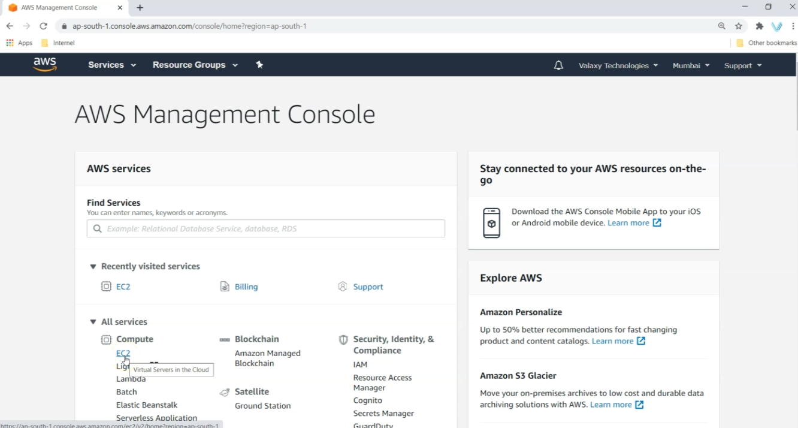

## Módulo 01: Introducción al curso

### Contenido

1. Descripción general
2. Antes de empezar
3. ¿Qué es el sistema de control de versiones?
4. Instalación de Git en Windows
5. Configure una instancia EC2 e instale Git en Linux
6. Trabajando con Git Bash


### 1. Descripción general

Vamos a aprender a usar un sistema de control de versiones creando repositorios locales y remotos, tanto individual como para trabajo en equipo.

Revisemos un poco el temario

### 2. Antes de empezar

Para realizar éste curso se requiere contar con:

1. Conocimientos básicos de Linux
2. Conocer acerca del servicio AWS EC2
3. Cuenta en Github (https://github.com/signup)
4. Cuenta en AWS o Linux Subsystem en Windows o Servidor Linux local. (https://portal.aws.amazon.com/billing/signup#/start/email)

### 3. ¿Qué es el sistema de control de versiones?

Para entender lo que hace un sistema de control de versiones primero veamos el porqué se necesita partiendo del problema:

> Si tú necesitas escribir <código /> con un **grupo de personas**

La solución es usar un sistema de control de versiones que permite:

1. Llevar un registro de tus cambios realizados al código.
2. Permite realizar desarrollo colaborativo
3. Permite conocer quien y cuando realizó un cambio
4. Permite deshacer cualquier cambio
5. Ayuda a realizar un flujo de trabajo organizado.

Ahora también tenemos 3 tipos de control de versiones:

1. Local

2. Centralizado

3. Distribuido


Existen varios sistemas de control de versiones:

1. **Git** 
2. Subversion
3. Mercurial
4. Perforce

### 4. Instalación de Git en Windows

Nuestros hambientes de desarrollo será el siguiente:

1. Desarrollador 1 en Windows
2. Desarrollador 2: en Linux AWS EC2 Instance o LWS

Entonces para instalar git wn Windows hay que descargarlo desde la dirección: https://git-scm.com/download/win

Se pueden usar las opciones por **default**, tras instalar se puede iniciar la aplicación git bash lo que abrirá una ventana que nos permitirá ejecutar git y para corroborar ejecuta el comando `git --version`


### 5. Configure una instancia EC2 e instale Git en Linux

1. Crear una instancia de EC2


2. Lanzando una instancia de EC2


3. Seleccionar Ubuntu como la distribución de Linux


4. ...

Después de obtener la dirección IP de la instancia de EC2, en tu equipo local hay que instala run cliente para SSH:

1. MobaXterm: https://mobaxterm.mobatek.net/
2. Kitty http://www.9bis.net/kitty/#!pages/download.md

Realizar la conexión usando la IP obtenida y el archivo de llave descargado.


Nota: Considera que el usuario por default para una instancia de EC2 es: **ec2-user**

Una vez conectado hay que instalar git usando el comando: `sudo apt install git`

### 6. Trabajando con Git Bash

En nuestro equipo local iniciamos git bash y realizamos la configuración inicial de git con los siguientes comandos:

```
git config --global user.name "rctorr"
git config --global user.email "rctorr@gmail.com"
```

Para mostrar la configuración se puede ejecutar:

```
git config --global user.name
git config --global user.email
```

Y también en la terminal abierta para Linux ejecutar:

```
git config --global user.name "rctorr.ec2"
git config --global user.email "rctorr@gmail.com"
```

Si deseas ver todas las configuraciones de git se usa el comando:

```
git config --list
```

