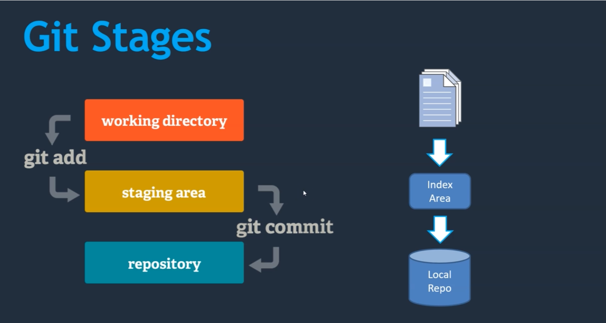

## Módulo 02: Trabajando con Git

### Contenido

1. Crear un repositorio en Git
2. Git Stages
3. Git Workflow
4. Comparar cambios de código con diferentes Git Stages
5. Comparar cambios de código con diferentes commits locales

### 1. Crear un repositorio en Git

Lo primero que vamos a crear es un repositorio (repo) que no es más que una carpeta con información adicional.

En general todos los comandos de git los ejecutamos dentro de ésta carpeta del repo.

Para ejecutar los comandos de git usando el comando `git`, ahora vamos a crear nuestro primer repositorio.

Primero creamos la carpeta `demorepo` en el Escritorio de tu computadora y luego abrimos git-bash usando el menú contextual usando la opción **Git Bash aquí** o también podemos abrir la aplicación **Git Bash** y luego navegar a la carpeta `demorepo` usando el comando `cd`.

Ahora inicializamos el repo con el comando `git init` y observa lo que pasa en la carpeta.

En **Git Bash** o **Linux** se puede usar el comando `ls -a` para ver los archivos ocultos.

También es bueno conocer el comando `cat` ya sea para examinar archivos o incluso para crearlos, aunque muchos serán creado usando un editor de código.

### 2. Git Stages

Vamos a revisar los estados de un conjunto de archivos

Vamos a crear dos archivos llamandolos `archivo-1.txt` y `archivo-2.txt` y luego veamos que se encuentran en el directorio de trabajo, entonces los tenemos que pasar al área de índice y finalmente al repo local.

Revisamos las opciones:

- git add archivos
- git add .
- git add --all
- git status

Entonces revisar la rama actual, seguramente **master**.

- git rm --cached file
- git log
- git commit -m "mensaje"
- git status
- git log

### 3. Git Workflow

- touch
- vim
- creamos dos archivos más con contenido
- git stratus
- git add archivo # por tarea
- git log

### 4. Comparar cambios de código con diferentes Git Stages

- renombrando un archivo
- modificando un archivo
- git diff local vs stage
- git diff --staged stage vs local repo
- git diff --staged HEAD
- git diff HEAD local vs local repo

### 5. Comparar cambios de código con diferentes commits locales

- git diff id(6) id(6)
- git diff id(6)