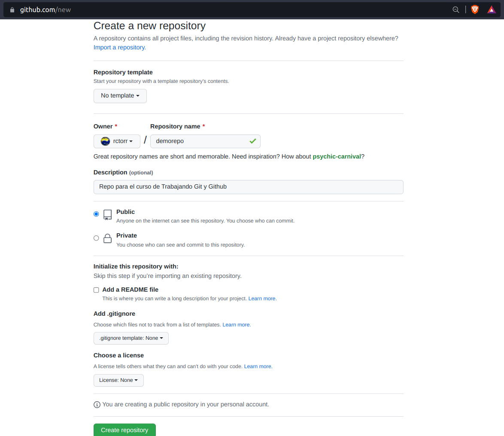
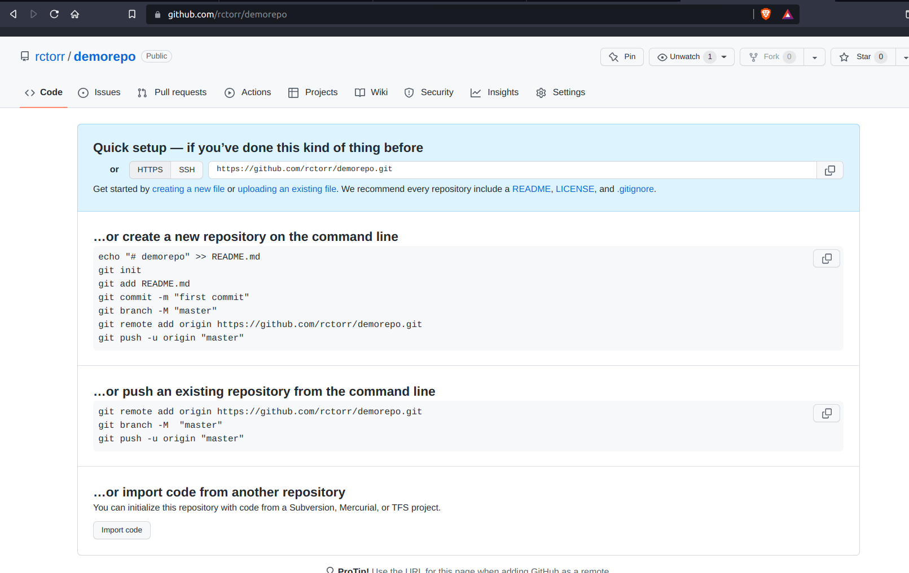
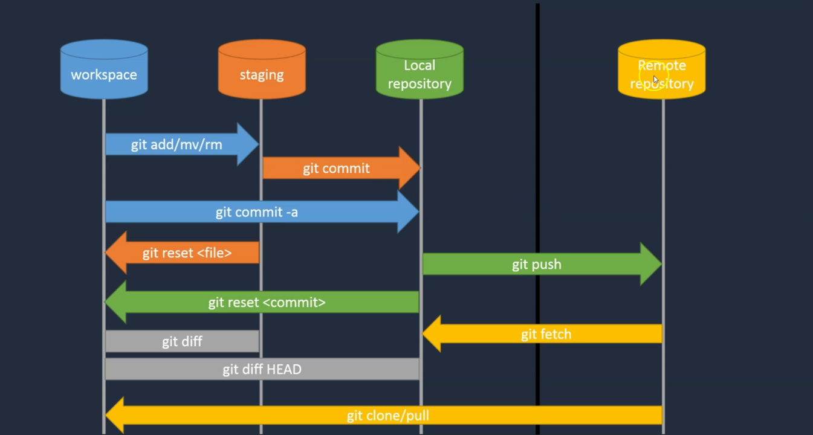
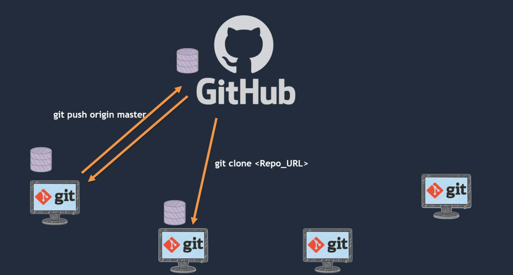

## Módulo 03: Trabajar con Github

### Contenido

1. ¿Por qué necesitamos GitHub?
2. Crear una cuenta de GitHub
3. Crear un repositorio en GitHub
4. Clonar un repositorio desde GitHub
5. Insertar el código en el repositorio remoto

### 1. ¿Por qué necesitamos GitHub?


Hasta éste momento hemos trabajando con un repo en local, en nuestro propio equipo, pero que pasa si queremos compartir nuestros cambios con otros programadores, entonces hacemos uso de un repo central, en éste caso Github, pero hay otros servicios similares por ejemplo:

- Github (https://github.com)
- GitLap (https://about.gitlab.com)
- Bitbucket (https://bitbucket.org/)

### 2. Crear una cuenta de GitHub

Para pode trabajar con Github, necesitamos crear una cuenta, es buen momento para hacerlo si no tienes una cuenta en GitHub aún.

El link para crear una cuenta es: https://github.com/signup

Es importante validar la cuenta dando click en el mensaje de email recibido y listo ya estará la cuenta para poder continuar.

### 3. Crear un repositorio en GitHub


Lo primero es entrar con nuestra cuenta en Github, nos dirigimos al **Perfil** y nos dirigimos a la opción **Repositories**, podemos crear un nuevo repo usando el botón verde **New** o desde el menú **New repository**.

El nuevo repositorio lo llamaremos **demorepo** igual justo como la carpeta local de trabajo.



Después de crear el repo tenemos la siguiente información que aparece sólo cuando acabamos de crear el repo:



Entonces es momento de vincular el repo en Github con nuestro repo en local vamos a la ventana de **git-bash** y ejecutemos los comandos sugeridos por la página de Github:

**Nota**: Es importante revisar que nuestro repo local se encuentre en un estado limpio, si no es así encontes hay que crear un commit.

```
$ git remote add origin https://github.com/rctorr/demorepo.git
$ git branch -M "master"
$ git push -u origin master
Username for 'https://github.com': rctorr
Password for 'https://rctorr@github.com': 
Enumerando objetos: 12, listo.
Contando objetos: 100% (12/12), listo.
Compresión delta usando hasta 4 hilos
Comprimiendo objetos: 100% (10/10), listo.
Escribiendo objetos: 100% (12/12), 1.29 KiB | 1.29 MiB/s, listo.
Total 12 (delta 1), reusado 0 (delta 0), pack-reusado 0
remote: Resolving deltas: 100% (1/1), done.
To https://github.com/rctorr/demorepo.git
 * [new branch]      master -> master
Rama 'master' configurada para hacer seguimiento a la rama remota 'master' de 'origin'.
```

Después de esto ya podemos actualizar la página del repo en Github y deberán de aparecer nuestros archivos.

Sería bueno considerar documentar el repo agregando un archivo `Readme.md` para conocer de que trata el contenido del repo y en dado caso como se puede hacer funcionar.

Así que agregamos un archivo `Readme.md` basico recordando que se puede hacer uso del texto con formato tipo **Markdown**, si se quiere revisar una quía de las reglas con las que cuenta Markdown se puede cosultar el sitio: https://commonmark.org/help

El contenido del `Readme.md` puede ser similar al siguiente:

```
# Proyecto demorepo

## Descripción

Éste proyecto permite crear varios ensayos sobre el uso de Git y Github por lo que podría no ser tan coherente como uno esperaría.

## Contendio

El contenido está distribuido de la siguiente manera:
...

## Para hacer funcionar éste proyecto
```
Entonces agregamos los cambios a nuestro repo local y para enviar los cambio al repo centrao o remote lo realizamos con:

```
$ git push
Username for 'https://github.com': rctorr
Password for 'https://rctorr@github.com': 
Enumerando objetos: 4, listo.
Contando objetos: 100% (4/4), listo.
Compresión delta usando hasta 4 hilos
Comprimiendo objetos: 100% (3/3), listo.
Escribiendo objetos: 100% (3/3), 547 bytes | 547.00 KiB/s, listo.
Total 3 (delta 0), reusado 0 (delta 0), pack-reusado 0
To https://github.com/rctorr/demorepo.git
   b32f272..8cf2cbf  master -> master
```

Entonces con `git push` podemos enviar los cambios de la rama actual (master) al repo remoto en la misma rama, en éste caso no es necesario indicar el nombre del repo remoto llamado **origin** que es el nombre que se ha usdo por default, pero podríamos haberlo llamado **github**.

### 4. Clonar un repositorio desde GitHub



Una forma de obtener un repo completo incluyendo todo el seguimiento del repo y los archivos en la carpeta de trabajo es usando el comando `git clone repo`

Para clonar un repo necesitamos la URL del repo que generalmente incluye el nombre del servidor, usuario y repo, lo podemos obtener de la página del repo presionando el botón verde que dice **CODE**, en mi caso la dirección obtenida es `https://github.com/rctorr/demorepo.git`

Así que vamos a clonar nuestro repo usando nuestra cuenta en el Servidor Linux, nos conectamos usando algún cliente de SSH y realizamos el siguiente comando:

```
$ git clone https://github.com/rctorr/demorepo.git
Clonando en 'demorepo'...
remote: Enumerating objects: 15, done.
remote: Counting objects: 100% (15/15), done.
remote: Compressing objects: 100% (12/12), done.
remote: Total 15 (delta 2), reused 14 (delta 1), pack-reused 0
Recibiendo objetos: 100% (15/15), listo.
Resolviendo deltas: 100% (2/2), listo.
$ 
```
Ésto crea la carpeta `demorepo/` en el espacio del usuario de trabajo, nos cambiamos a la carpeta y ejecutamos algunos comandos de git como status y log:

```
$ git status
En la rama master
Tu rama está actualizada con 'origin/master'.

nada para hacer commit, el árbol de trabajo esta limpio

$ git log
commit 8cf2cbfd613dcba994bd9764f9505b544c343cd5 (HEAD -> master, origin/master, origin/HEAD)
Author: rctorr <rictor@cuhrt.com>
Date:   Fri Jul 22 02:03:42 2022 -0500

    Agregando descripción del proyecto

commit b32f272bcc76fda297517ca2107d8d57a2208027
Author: rctorr <rictor@cuhrt.com>
Date:   Thu Jul 21 22:58:34 2022 -0500

    Agregando 3 líneas al archivos index.php

commit bfab31e014fb8b073bbc9e2bcb6666fc3a644f90
Author: rctorr <rictor@cuhrt.com>
Date:   Thu Jul 21 22:01:55 2022 -0500

    Renombrando archivo index.html a index.php
...

$ 
```
Con lo que comprobamos que ya contamos con todos los archivos del repo en el nuevo espacio de trabajo.

### 5. Insertar el código en el repositorio remoto



Ahora vamos a ver cual es el flujo de trabajo en git ya teniendo un repo remoto configurado, vamos a crear la carpeta `public_html/` y dentro de ésta vamos a crear el siguiente archivo html. Nota que las carpetas vacías no se pueden agregar como parte del seguimiento de git, ya que sólo hace seguimiento de archivos, así que se requiere de cuando menos un archivo para incluir una carpeta en el repo.

Ahora creamos el archivo `public_html/index.html` con el siguiente contenido:

```
<!DOCTYPE html>
<html>
<body>
    <nav><a href="index.html">Inicio</a> | <a href="perfiles.html">Perfiles</a></nav>
    <section>
       <h2>Página de inicio</h2>
       <hr />
       <p>Párrafo principal de la página de inicio</p>
    </section>
    <footer>
       <p>Derechos reservador @rctorr</p>
    </footer>
</body>
</html>
```

Y también creamos el archivo `perfiles.html` con el siguiente contenido:

```
<!DOCTYPE html>
<html>
<body>
    <nav><a href="index.html">Inicio</a> | <a href="perfiles.html">Perfiles</a></nav>
    <section>
       <h2>Página de perfiles</h2>
       <hr />
       <ul>
          <li><a href="perfiles/alejandro.html">Alejandro</a></li>
          <li><a href="perfiles/jesus.html">Jesus</a></li>
          <li><a href="perfiles/marco.html">marco</a></li>
          <li><a href="perfiles/ricardo.html">Ricardo</a></li>
       </ul>
       <hr />
    </section>
    <footer>
       <p>Derechos reservador @rctorr</p>
    </footer>
</body>
</html>
```

Ahora tenenos dos nuevos archivo que agregamos al repo y revisamos el status actual:

```
$ git status
En la rama master
Tu rama está adelantada a 'origin/master' por 1 commit.
  (usa "git push" para publicar tus commits locales)

nada para hacer commit, el árbol de trabajo esta limpio
```

Y como el repo local ya está vinculado con el repo remoto vemos como nos indica que localmente tenemos un commit por delante del repo remoto, incluso lo podemos ver también con el comando `git log`:

```
$ git log
commit c059427da5ecb6796945a2076151fec01dd02c77 (HEAD -> master)
Author: rictor <rictor@gmail.com>
Date:   Fri Jul 22 02:53:43 2022 -0500

    Agregando los archivo index y perfiles de la carpeta public_html/

commit 8cf2cbfd613dcba994bd9764f9505b544c343cd5 (origin/master, origin/HEAD)
Author: rctorr <rictor@cuhrt.com>
Date:   Fri Jul 22 02:03:42 2022 -0500

    Agregando descripción del proyecto

commit b32f272bcc76fda297517ca2107d8d57a2208027
Author: rctorr <rictor@cuhrt.com>
Date:   Thu Jul 21 22:58:34 2022 -0500

    Agregando 3 líneas al archivos index.php
```

Donde vemos que la etiqueta HEAD en el repositorio remoto está un commit atrás, así que una buena práctica al terminar el día es siempre siempre hacer un `git push` para subir los cambios realizados de forma local y de ésta forma el demás equipo podrá tener acceso.

```
$ git push 
Username for 'https://github.com': rctorr
Password for 'https://rctorr@github.com': 
Enumerando objetos: 6, listo.
Contando objetos: 100% (6/6), listo.
Compresión delta usando hasta 4 hilos
Comprimiendo objetos: 100% (5/5), listo.
Escribiendo objetos: 100% (5/5), 826 bytes | 826.00 KiB/s, listo.
Total 5 (delta 1), reusado 0 (delta 0), pack-reusado 0
remote: Resolving deltas: 100% (1/1), completed with 1 local object.
To https://github.com/rctorr/demorepo.git
   8cf2cbf..c059427  master -> master

$ git log
commit c059427da5ecb6796945a2076151fec01dd02c77 (HEAD -> master, origin/master, origin/HEAD)
Author: rictor <rictor@gmail.com>
Date:   Fri Jul 22 02:53:43 2022 -0500

    Agregando los archivo index y perfiles de la carpeta public_html/

commit 8cf2cbfd613dcba994bd9764f9505b544c343cd5
Author: rctorr <rictor@cuhrt.com>
Date:   Fri Jul 22 02:03:42 2022 -0500

    Agregando descripción del proyecto
...
```
Podemos ver como ambas etiquetas HEAD ya apuntan al último commit.
