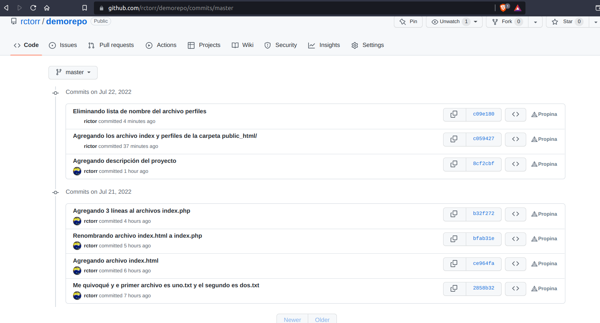
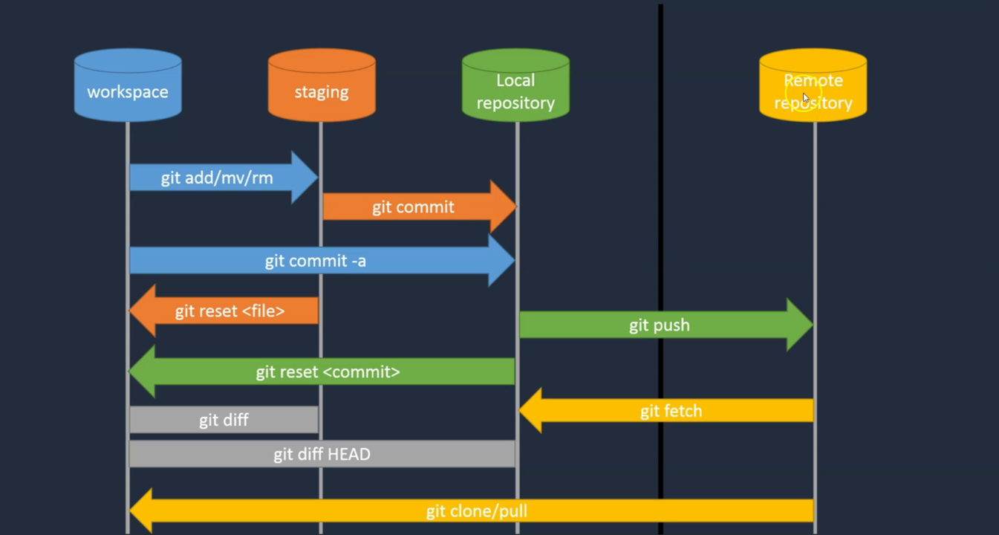
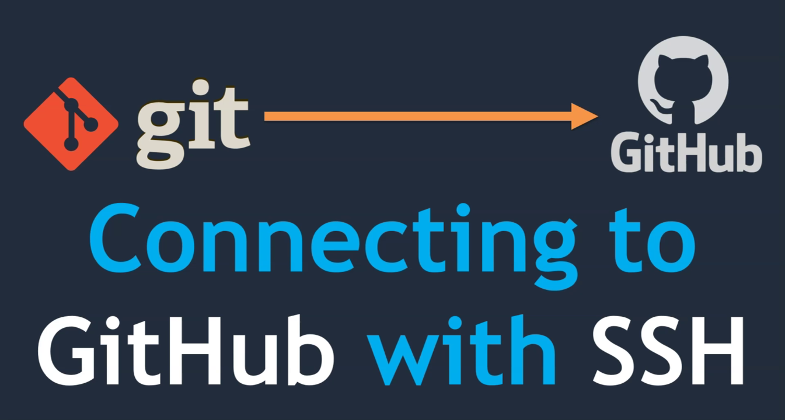

## Módulo 04: Trabajar con otros desarrolladores

### Contenido

1. Trabajar con otro código de desarrollador
2. Git Clone versus Git Pull
3. No se pueden enviar cambios al repositorio remoto
4. Conexión a GitHub usando ssh
5. Asignar repositorio local con repositorio remoto
6. Cómo un desarrollador envía código a un repositorio remoto

### 1. Trabajar con otros desarrolladores

En el módulo anterior ya clonamos el repo en nuestro usuario del servidor Linux, ahora vamos a realizar una modificación, pero antes como una buena práctica es iniciar con un status de repo limpio y ejecutar el comando `git pull` que permite obtener los cambios que existan en el repo remoto y actualizar nuestro repo local y también nuestra carpeta de trabajo.

```
$ git pull
git pull
Ya está actualizado.

$ 
```
En éste caso la rama ya está actualizada, como no se indica la rama se usa la rama actual que es **master**.

Ahora supongamos que el archivo `perfiles.html` tiene mucha información ya que se ha agregado vonculos a perfiles que no existen y no se sabe con certeza cuando estarán en línea, así que vamos a leiminar la lista de perfiles y sólo dejmos un código comentado para que se vayan agregando, éste archivo lo modificamos desde nuestra cuenta en el servidor Linux y el código quedaría como el siguiente:

```
<!DOCTYPE html>
<html>
<body>
    <nav><a href="index.html">Inicio</a> | <a href="perfiles.html">Perfiles</a></nav>
    <section>
       <h2>Página de perfiles</h2>
       <hr />
       <ul>
          <!-- li><a href="perfiles/nombre.html">Nombre</a></li-->
       </ul>
       <hr />
    </section>
    <footer>
       <p>Derechos reservados @rctorr</p>
    </footer>
</body>
</html>
```
Agregamos el cambio al repo y enviamos el cambio a github:

```
$ git add perfiles.html 
$ git commit -m "Eliminando lista de nombre del archivo perfiles"
[master c09e180] Eliminando lista de nombre del archivo perfiles
 1 file changed, 2 insertions(+), 5 deletions(-)
$ git push 
Username for 'https://github.com': rctorr
Password for 'https://rctorr@github.com': 
Enumerando objetos: 7, listo.
Contando objetos: 100% (7/7), listo.
Compresión delta usando hasta 4 hilos
Comprimiendo objetos: 100% (4/4), listo.
Escribiendo objetos: 100% (4/4), 444 bytes | 444.00 KiB/s, listo.
Total 4 (delta 2), reusado 0 (delta 0), pack-reusado 0
remote: Resolving deltas: 100% (2/2), completed with 2 local objects.
To https://github.com/rctorr/demorepo.git
   c059427..c09e180  master -> master

$ 
```
Y ahora podemos comprobar los cambios en Github directamente, podemos ver el nuevo código, el tiempo en que realizó el último commit, la lista de commits, las ramas existentes entre otras cosas.

También en la lista de commit podemos ver como ahora ya tenemos dos colaboradores haciendo uso de la misma cuenta.



### 2. Git Clone versus Git Pull



Ahora vamos a cambiarnos al desarrollador 1 que era nuestra configuración en **git-bash**, así que nos vamos a la carpeta del repo y ejecutamos el comando `git pull origin master` o simplemente `git pull` por default toma la rama actual y el repo remoto por defaul.

```
$ git pull
git pull
remote: Enumerating objects: 10, done.
remote: Counting objects: 100% (10/10), done.
remote: Compressing objects: 100% (7/7), done.
remote: Total 9 (delta 3), reused 8 (delta 2), pack-reused 0
Desempaquetando objetos: 100% (9/9), 1.15 KiB | 590.00 KiB/s, listo.
Desde https://github.com/rctorr/demorepo
   8cf2cbf..c09e180  master     -> origin/master
Actualizando 8cf2cbf..c09e180
Fast-forward
 public_html/index.html    | 15 +++++++++++++++
 public_html/perfiles.html | 18 ++++++++++++++++++
 2 files changed, 33 insertions(+)
 create mode 100644 public_html/index.html
 create mode 100644 public_html/perfiles.html
```
Lo que ha pasado es que se han obtenido los dos commits realizados por el usuario **rictor** en mi caso, entonces con `git pull` podemos obtener los nuevos cambios que se hayan agregado al repo central y que es una buena práctica realizarlo al inicio de una sesión de trabajo iniciando con un repo en status limpio.

En contra parte cuando ejecutamos `git clone` obtenemos todo los archivos del repo y sólo es posible ejecutar cuando no existe de forma local, si intentamos colnar nuevamente el repo obtendríamos algo similar a lo siguiente:

```
$ git clone https://github.com/rctorr/demorepo.git
fatal: la ruta de destino 'demorepo' ya existe y no es un directorio vacío.

$ 
```

### 3. No se pueden enviar cambios al repositorio remoto

Vamos a ver un primer caso en que no es posible enviar los cambios realizados en el repo local a github, así que vamos a realizar unos cambios, pero en nuestra ventana de **git-bash** vamos a modificar el archivo `public_html/index.html` quedando de la siguiente forma:

```
<!DOCTYPE html>
<html>
<body>
    <nav><a href="index.html">Inicio</a> | <a href="perfiles.html">Perfiles</a></nav>
    <section>
       
       <h2>Página de inicio</h2>
       <hr />
       <p>Párrafo principal de la página de inicio</p>
    </section>
    <footer>
       <p>Derechos reservador @rctorr</p>
    </footer>
</body>
</html>
```
Y descargamos un banner de internet y lo guardamos en la ruta `public_html/static/image/banner.jpg`

Y agregamos los cambios a nuestro repo local y revisamos el estado resultante con `git log`:

```
$ git log
commit f229371292f983ed292ea2317e39758808f16468 (HEAD -> master)
Author: rctorr <rictor@cuhrt.com>
Date:   Fri Jul 22 04:06:30 2022 -0500

    Agregando banner a la página principal

commit c09e1803698909ac794dcea07e4f08d708ff7955 (origin/master)
Author: rictor <rictor@gmail.com>
Date:   Fri Jul 22 03:26:11 2022 -0500

    Eliminando lista de nombre del archivo perfiles

commit c059427da5ecb6796945a2076151fec01dd02c77
Author: rictor <rictor@gmail.com>
Date:   Fri Jul 22 02:53:43 2022 -0500

    Agregando los archivo index y perfiles de la carpeta public_html/
...
```
Hemos creado un commit que tiene como referencia el commit anterior, o sea el commit c09e18, hasta aquí todo bien.

Ahora vamos a nuestra terminar de Linux y vamos a crear el archivo `perfiles/nombre.html`:

```
<!DOCTYPE html>
<html>
<body>
    <nav><a href="index.html">Inicio</a> | <a href="perfiles.html">Perfiles</a></nav>
    <section>
       <h2>Perfil de: Nombre</h2>
       <hr />
       <ul>
          <li>Email: user@dominio</li>
	  <li>Extensión: 12345</li>
       </ul>
       <hr />
    </section>
    <footer>
       <p>Derechos reservados @rctorr</p>
    </footer>
</body>
</html>
```
Lo agregamos al repo local y examinamos con `git log`

```
$ git log
commit 89618738e03dad4ff7a34edb3394149a21334f0f (HEAD -> master)
Author: rictor <rictor@gmail.com>
Date:   Fri Jul 22 04:15:52 2022 -0500

    Agregamos la pantilla de para los perfiles en el archivo perfiles/nombre.html

commit c09e1803698909ac794dcea07e4f08d708ff7955 (origin/master, origin/HEAD)
Author: rictor <rictor@gmail.com>
Date:   Fri Jul 22 03:26:11 2022 -0500

    Eliminando lista de nombre del archivo perfiles

commit c059427da5ecb6796945a2076151fec01dd02c77
Author: rictor <rictor@gmail.com>
Date:   Fri Jul 22 02:53:43 2022 -0500

    Agregando los archivo index y perfiles de la carpeta public_html/
...
```
Se puede observar que éste commit también tiene como referencia el commit c09e18, pero los commits son consecutivos, en una rama, veamos que pasa cuando hacemos push, vamos a nuestra ventana de **git-bash**

```
$ git push 
Username for 'https://github.com': rctorr
Password for 'https://rctorr@github.com': 
Enumerando objetos: 10, listo.
Contando objetos: 100% (10/10), listo.
Compresión delta usando hasta 4 hilos
Comprimiendo objetos: 100% (5/5), listo.
Escribiendo objetos: 100% (7/7), 192.17 KiB | 19.22 MiB/s, listo.
Total 7 (delta 2), reusado 0 (delta 0), pack-reusado 0
remote: Resolving deltas: 100% (2/2), completed with 2 local objects.
To https://github.com/rctorr/demorepo.git
   c09e180..f229371  master -> master
```
El push se ha realizado sin problema porque el repo centra tiene el mismo estado con el que iniciamos, ahora vamos a hacer el push en la ventana de Linux:

```
$ git push 
Username for 'https://github.com': rctorr
Password for 'https://rctorr@github.com': 
To https://github.com/rctorr/demorepo.git
 ! [rejected]        master -> master (fetch first)
error: fallo el push de algunas referencias a 'https://github.com/rctorr/demorepo.git'
ayuda: Actualizaciones fueron rechazadas porque el remoto contiene trabajo que
ayuda: no existe localmente. Esto es causado usualmente por otro repositorio 
ayuda: realizando push a la misma ref. Quizás quiera integrar primero los cambios
ayuda: remotos (ej. 'git pull ...') antes de volver a hacer push.
ayuda: Vea 'Notes about fast-forwards0 en 'git push --help' para detalles.

$ 
```
Nos aprece un error, porque se intenta hacer un push usando una referencia al último commit que ya no existe, así que primero hay que hacer un pull y fusionar los cambios, el resultado lo podemos ver con `git log`:

```
$ git pull
ayuda: Hacer un pull sin especificar cómo reconciliar las ramas es poco
ayuda: recomendable. Puedes eliminar este mensaje usando uno de los
ayuda: siguientes comandos antes de tu siguiente pull:
ayuda: 
ayuda:   git config pull.rebase false  # hacer merge (estrategia por defecto)
ayuda:   git config pull.rebase true   # aplicar rebase
ayuda:   git config pull.ff only       # aplicar solo fast-forward
ayuda: 
ayuda: Puedes reemplazar "git config" con "git config --global" para aplicar
ayuda: la preferencia en todos los repositorios. Puedes también pasar --rebase,
ayuda: --no-rebase, o --ff-only en el comando para sobrescribir la configuración
ayuda: por defecto en cada invocación.
fatal: Necesita especificar cómo reconciliar las ramas divergentes.
$ git config --global pull.rebase false
$ 
```
En las nuevas versiones de git pide que se indique que estrategía se usará para mezclar ramas, lo que veremos más adelante, así que por el momento vamos a usar la estrategia por default que implica hacer un merge (mezclar) y crear un nuevo commit con el resultado, ahora si realizamos nuevamente el `git pull`:

```
$ git pull
```
Tras ejecutar el comando no aparece un editor mostrando la información de la mezcla que va a realizar:

```
Merge branch 'master' of https://github.com/rctorr/demorepo
# Por favor ingrese un mensaje de commit que explique por qué es necesaria esta>
# especialmente si esto fusiona un upstream actualizado en una rama de tópico.
#
# Líneas comenzando con '#' serán ignoradas, y un mensaje vacío aborta
#  el commit.
```
Lo importante es la primera línea que no está comentada, todas las líneas comentadas son ignoradas e indica que va a mezclar los cambios obtenido de la rama master del repo en github con los cambios en el repo local, aquí tenemos que guardar el archivo y salir del editor.

Así que ahora el comando `git pull` regresa los siguiente:

```
$ git pull
Merge made by the 'ort' strategy.
 public_html/index.html              |   1 +
 public_html/static/image/banner.jpg | Bin 0 -> 196872 bytes
 2 files changed, 1 insertion(+)
 create mode 100644 public_html/static/image/banner.jpg
$ 
```
Lo que indica que se está obteniendo los cambios realizados por el otro usuario y como no ha habido conflictos la mezcla (merege) se realizó con éxito.

Ahora si vemos el `git log`:

```
$ git log
commit a062d9c6f0629de00df8c78210a2ab08a744f833 (HEAD -> master)
Merge: 8961873 f229371
Author: rictor <rictor@gmail.com>
Date:   Fri Jul 22 04:31:53 2022 -0500

    Merge branch 'master' of https://github.com/rctorr/demorepo

commit 89618738e03dad4ff7a34edb3394149a21334f0f
Author: rictor <rictor@gmail.com>
Date:   Fri Jul 22 04:15:52 2022 -0500

    Agregamos la pantilla de para los perfiles en el archivo perfiles/nombre.html

commit f229371292f983ed292ea2317e39758808f16468 (origin/master, origin/HEAD)
Author: rctorr <rictor@cuhrt.com>
Date:   Fri Jul 22 04:06:30 2022 -0500

    Agregando banner a la página principal
...
```
Observamos que la lista y secuencia de commit ha cambiado, y nuestro comit local ahora del commit realizado por el otro usuario y la fusión de ambos commits se registra como un commit adicional, entonces ahora si podemos hacer un `git push`

```
$ git push 
Username for 'https://github.com': rctorr
Password for 'https://rctorr@github.com': 
Enumerando objetos: 12, listo.
Contando objetos: 100% (12/12), listo.
Compresión delta usando hasta 4 hilos
Comprimiendo objetos: 100% (7/7), listo.
Escribiendo objetos: 100% (8/8), 1013 bytes | 1013.00 KiB/s, listo.
Total 8 (delta 3), reusado 0 (delta 0), pack-reusado 0
remote: Resolving deltas: 100% (3/3), completed with 2 local objects.
To https://github.com/rctorr/demorepo.git
   f229371..a062d9c  master -> master
```
Podemos ver como el push se realizó con éxito y lo podemos validar también en GitHub.

### 4. Conexión a GitHub usando ssh



Hasta el momento no hemos autenticado a los repos en Github usando usuario y tokens, pero también podemos usar una llave ssh, para ellos github cuando con una guía que se puede encontrar en https://docs.github.com/es/authentication/connecting-to-github-with-ssh

Primero en nuestra cuenta en Linux vamos a crear nuestra llave ssh usando el comando `ssh-keygen`:

```
$ ssh-keygen 
Generating public/private rsa key pair.
Enter file in which to save the key (/home/rictor/.ssh/id_rsa): 
Created directory '/home/rictor/.ssh'.
Enter passphrase (empty for no passphrase): 
Enter same passphrase again: 
Your identification has been saved in /home/rictor/.ssh/id_rsa
Your public key has been saved in /home/rictor/.ssh/id_rsa.pub
The key fingerprint is:
SHA256:hmbCF3vVkxp8laMv/NwTTCoMunvoOGRqcwh3EpGczdE rictor@fibo
The key's randomart image is:
+---[RSA 3072]----+
|  . =.o       .. |
|   = o E . . oo  |
|    . .   + =. . |
|   o   + o +.. . |
|    + * S +. .+  |
| . o O +   oo..o |
|  o B   o   .+ ..|
|   = o.o .    o..|
|  . o.ooo       .|
+----[SHA256]-----+
$ 
```
Esto dos archivos en la carpeta `HOME/.ssh/` llamados `id_rsa` y `id_rsa.pub` este es un mecanismo de llave pública y llave privada y el archivo que nunca debemos compartir con nadie es `id_rsa`.

Ahora se agrega la parte de la llave privada al sistema de autenticación de Linux usando los comandos:

```
$ eval "$(ssh-agent -s)"
Agent pid 405596
$ ssh-add ~/.ssh/id_rsa
Identity added: /home/rictor/.ssh/id_rsa (rictor@fibo)
```

Ahora vamos a intentar clonar nuevamente el repo pero usando la opción por ssh, primero renombramos nuestra carpeta actual y clonamos el repo:

```
$ mv demorepo demorepo.1
$ git clone git@github.com:rctorr/demorepo.git
Clonando en 'demorepo'...
The authenticity of host 'github.com (140.82.114.4)' can't be established.
ED25519 key fingerprint is SHA256:+DiY3wvvV6TuJJhbpZisF/zLDA0zPMSvHdkr4UvCOqU.
This key is not known by any other names
Are you sure you want to continue connecting (yes/no/[fingerprint])? yes
Warning: Permanently added 'github.com' (ED25519) to the list of known hosts.
git@github.com: Permission denied (publickey).
fatal: No se pudo leer del repositorio remoto.

Por favor asegúrese que tiene los permisos de acceso correctos
y que el repositorio existe.
```
Lo que indica que ni temenos permisos para clonar el repo, así que vamos a agregar los permisos, para ello vamos a obtener el contenido del archivo `HOME/.ssh/id_rsa.pub` y lo copiamos.

Ahora vamos a Github, en particular a Settings -> SSH and GPG keys -> New ssh key, colocamos un nombre a la nueva llave y agregamos el texto copiado y guardamos los cambios.

Ahora volvemos a clonar el repo:

```
$ git clone git@github.com:rctorr/demorepo.git
Clonando en 'demorepo'...
remote: Enumerating objects: 39, done.
remote: Counting objects: 100% (39/39), done.
remote: Compressing objects: 100% (27/27), done.
remote: Total 39 (delta 13), reused 33 (delta 7), pack-reused 0
Recibiendo objetos: 100% (39/39), 195.51 KiB | 820.00 KiB/s, listo.
Resolviendo deltas: 100% (13/13), listo.
```
De ésta forma no es necesario estar proporcionado el usuario y password que también podría ser una posible falla de seguridad y los mismo afecta para `git pull` y `git push`.

Ahora se realiza justo el mismo procedmimiento para **git-bash** y se clona el repo nuevamente para validar los accesos.

### 5. Asignar repositorio local con repositorio remoto

A veces hacemos un pull de una rama a Github pero si hace seguimientos de los cambios entre ambas ramas, local y remota, cuando eso sucede podemos usar el comando: `git branch --set-upstream-to=origin/master master` con lo que indicamos como estarán vinculadas ambas ramas.

Para poner en práctica ésta operación:

1. Crea un nuevo proyecto llamado `demorepo2` local y agrega un archivo `index.html` con una línea de código
2. Inicializar un nuevo repo y agrega los cambios
3. Crea un repo en Github con el mismo nombre y ejecuta el comando `git push` de la siguiente forma `git push origin master` nota que no está la opción -u. En este punto aunque la ramas están vinculada no hay seguimiento entre ambas, así que el repo local no sabe si está por delante o atrás del repo en Github,
4. Para corregir éso ejecuta el comando: `git branch --set-upstream-to=origin/master master` y valida con un `git status` 

### 6. Cómo un desarrollador envía código a un repositorio remoto

Primero vemos todas las variables de configuración:

```
$ git config --list
...
remote.origin.url=git@github.com:rctorr/demorepo.git
remote.origin.fetch=+refs/heads/*:refs/remotes/origin/*

$ 
```
Observamos unas variables que contienen la información del repo remoto vinculado a nuestro repo local, pero podemos ver ésta información usando el comando `remote` de git de la siguiente forma:

```
$ git remote -v
origin	git@github.com:rctorr/demorepo.git (fetch)
origin	git@github.com:rctorr/demorepo.git (push)

$ 
```
Que tenemos dos línea, una usada para realizar el fetch o pull y otra para realizar el push, pero ambas asociadas al mismo nombre **origin**, así que vamos a eliminar el repo remoto llamado **origin**:

```
$ git remote remove origin
$ 
```

Ahora modificamos el archivo `public_html/index.html` agregando el siguiente código:

```
<head>
    <link rel="stylesheet" href="static/css/main.css">
</head>
```
Agregamos los cambios al `staging` y creamos un registro (`commit`) y finalmente hacemos un push de los cambios al repo remoto:

```
$ git add public_html/index.html
$ git commit -m "Actualizando index.html con los archivos de estilos esternos en static/css/main.css"
$ git push 
fatal: No se ha configurado un destino para el push.
Puedes o especificar una URL desde la línea de comandos o configurar un repositorio remoto usando

    git remote add <nombre> <url>

y luego haciendo push al nombre del remoto

    git push <nombre>

$ 
```
Así que no podemos hacer push porque no hay un repo remoto asociado, así que lo asociamos nuevamente y hacemos el push:

```
$ git remote add github git@github.com:rctorr/demorepo.git
$ git remote -v
github	https://github.com/rctorr/demorepo2.git (fetch)
github	https://github.com/rctorr/demorepo2.git (push)
$ git push github master
Username for 'https://github.com': rctorr
Password for 'https://rctorr@github.com': 
Enumerando objetos: 7, listo.
Contando objetos: 100% (7/7), listo.
Compresión delta usando hasta 4 hilos
Comprimiendo objetos: 100% (4/4), listo.
Escribiendo objetos: 100% (4/4), 466 bytes | 466.00 KiB/s, listo.
Total 4 (delta 2), reusado 0 (delta 0), pack-reusado 0
remote: Resolving deltas: 100% (2/2), completed with 2 local objects.
To https://github.com/rctorr/demorepo2.git
   6b615d8..d7abb2a  master -> master
```

Ahora vamos a crear el archivo `static/css/main.css` con el contenido:

```
nav {
    margin: 0px;
    padding: 10px;
    background-color: rgb(200, 200, 200);
}
```
Creamos un registro en el repo con el nuevo archivo y vemos el estado:

```
$ git add public_html/static/css/main.css 
$ git commit -m "Agregando archivo main.css"
[master 7e40896] Agregando archivo main.css
 1 file changed, 6 insertions(+)
 create mode 100644 public_html/static/css/main.css
$ git status
En la rama master
nada para hacer commit, el árbol de trabajo esta limpio
```
Ahora git no sabe si está adelante o detrás del repo remoto en github porque no se usó la opción `-u` al momento de hacer el push, así que para activar sel seguimientos entre repo local y remoto usamos lo siguiente:

```
$ git branch --set-upstream-to=github/master master
Rama 'master' configurada para hacer seguimiento a la rama remota 'master' de 'github'.
$ git status
En la rama master
Tu rama está adelantada a 'github/master' por 1 commit.
  (usa "git push" para publicar tus commits locales)

nada para hacer commit, el árbol de trabajo esta limpio
```
Así que ahora podemos hacer un push o lo que necesitemos hacer, ¿tú que harías?

