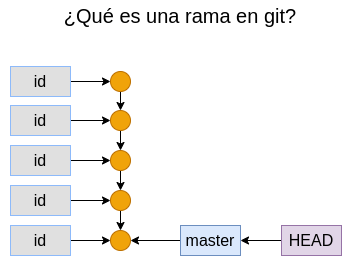
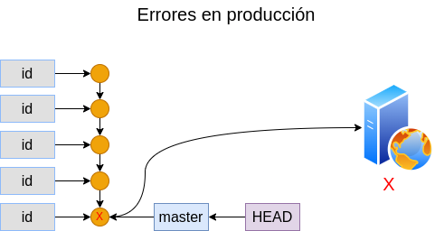
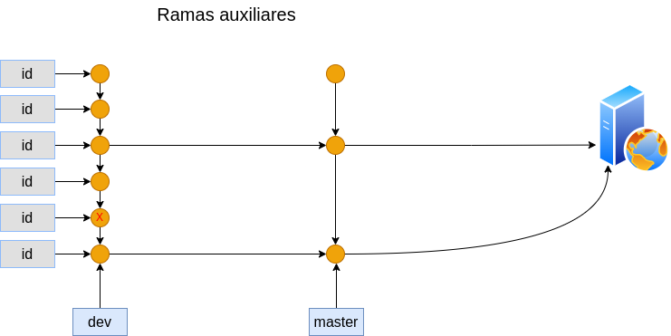
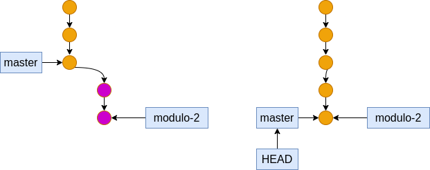
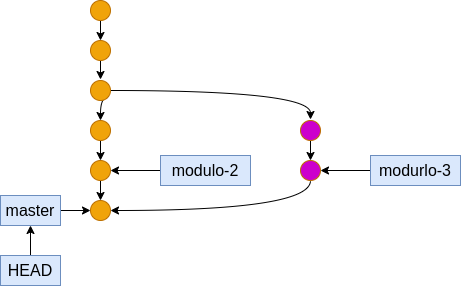

## Módulo 06: Branches (ramas)

### Contenido

1. ¿Por qué necesitamos branches?
2. Estrategia de ramificación para proteger el código de trabajo
3. Trabajar con branches en GitHub
4. Trabajando con branches en Git
5. Commit de cambios en branches
6. Merge de cambios en Master Branch desde Dev
7. Resolución de conflictos de Merge

### 1. ¿Por qué necesitamos branches?


Las ramas en git son el mecanismo por el que se guarda la historia de cambios con un nombre.



Así que una rama está compuesta por una serie de confirmaciones (commits) y cuyo nombre apunta a la última confirmación, cuando se inicializa un repo se crea en automático la etiqueta **master** y ésta siempre apunta al último commit de la rama.

Por lo general la etiqueta **HEAD** también apunta al último commit de la rama actual, pero en realidad **HEAD** apunta siempre al commit actual que puede ser cualquier commit de cualquier rama como ya lo vimos en el módulo anterior al estar investigando la información de un commit.

Si nosotros trabajamos con sólo la rama **master** donde se concentra el código de los distintos bloques del sistema, llega un momento en que alguna confirmación (commit) se tiene que ir a producción, si la confirmación en turno está todo bien, entonces producción estará bien también, pero si la confirmación tubiera una falla, entonces esa falla también existiría en producción afectando el servicio a cliente.



Una flujo de trabajo es hacer uso de ramas adicionales o auxiliares, por ejemplo una rama **dev** donde se agregen las confirmaciones de las nuevas funcionalidades para ser revisadas y eventualmente corregidas y entonces se envían a la rama **master** para ser enviadas a producción, entonces si se desea obtener la última versión en producción hay que ir último commit de la rama **master**.



Hagamos un ejemplo, primero vamos a clonar el repo https://github.com/rctorr/sistema-abc-plantilla

Desde nuestra ventana de git-bash, nos pasamos al escritorio y clonamos el repo mencionado:

```
$ cd Desktop
$ git clone git@github.com:rctorr/sistema-abc-plantilla.git
Cloning into 'sistema-abc-plantilla'...
remote: Enumerating objects: 11, done.
remote: Counting objects: 100% (11/11), done.
remote: Compressing objects: 100% (7/7), done.
remote: Total 11 (delta 2), reused 10 (delta 1), pack-reused 0
Receiving objects: 100% (11/11), done.
Resolving deltas: 100% (2/2), done.

User@WinDev2206Eval MINGW64 ~/Desktop
$ mv sistema-abc-plantilla sistema-abc

User@WinDev2206Eval MINGW64 ~/Desktop

$ 
```
Ahora eliminamos el vinculo del repo remoto, creamos un nuevo repo en github llamado **sistema-abc** y lo vinculamos con el repo de la carpeta `sistema-abc`:

```
$  git remote -v

$ git remote remove origin

$ git remote add origin git@github.com:rctorr/sistema-abc.git

$ git remote -v
origin  git@github.com:rctorr/sistema-abc.git (fetch)
origin  git@github.com:rctorr/sistema-abc.git (push)

$ git branch -M master

$ git push -u origin master
Enumerating objects: 11, done.
Counting objects: 100% (11/11), done.
Delta compression using up to 4 threads
Compressing objects: 100% (6/6), done.
Writing objects: 100% (11/11), 1.38 KiB | 706.00 KiB/s, done.
Total 11 (delta 2), reused 11 (delta 2), pack-reused 0
remote: Resolving deltas: 100% (2/2), done.
To github.com:rctorr/sistema-abc.git
 * [new branch]      master -> master
branch 'master' set up to track 'origin/master'.

$ 
```
Ahora nos vamos a nuestro usuario virtual en Linux y clonamos el repo recién creado y ejecutamos un servidor de pruebas para revisar el funcionamiento como si fuera producción:

```
$ git clone git@github.com:rctorr/sistema-abc.git
Clonando en 'sistema-abc'...
remote: Enumerating objects: 11, done.
remote: Counting objects: 100% (11/11), done.
remote: Compressing objects: 100% (6/6), done.
remote: Total 11 (delta 2), reused 11 (delta 2), pack-reused 0
Recibiendo objetos: 100% (11/11), listo.
Resolviendo deltas: 100% (2/2), listo.

$ cd sistema-abc
$ php -S 0.0.0.0:8000
[Fri Aug  5 03:37:32 2022] PHP 8.1.2 Development Server (http://0.0.0.0:8000) started
```
Y abrimos en el navegador la dirección del servidor http://10.10.20.100:8000 (o la ip que haya sido asignada y el puerto que cada quien haya designado) y revisamos que nuestro servidor de producción funcione correctamente ¿cierto?

### 2. Estrategia de ramificación para proteger el código de trabajo

En nuestra versión anterior puesta en producción no está funcionando correctamente del todo, así que hay que corregir, pero en ésta ocasión no vamos a trabajar directamente en la rama **master**, entonces necesitamos crear una estrategia de ramas que nos permitan administrar nuestro flujo de trabajo, posiblemente la estrategia más simple es crear dos ramas **dev** (para desarrollo) y **master** (para producción) que es la solución mencionada en el punto anterior, sin embargo cada estrategia no tiene porque ser rígida, por ejemplo se podría tener un flujo de trabajo como el siguiente:


Donde se crean ramas de desarrollo por cada nuevo requerimiento o cada módulo o cada sub proyecto y eventualmente terminan en **master** para ser llevadas a producción.

O si el proyecto es mucho más grande se pueden utilizar estrategias con más ramas 


### 3. Trabajar con branches en GitHub
Entonces vamos a resolver los herrores que hay, el promero lo vamos a resolver directamente desde Github, para ellos vamos a ir al botón de la rama **master** dar click y crear la rama **modulo-2**

Estándo en la nueva rama editar el archivo `index.html` para hacer que la referencia al archivo `modulos/modulo-2.html` sea la correcta y hacer una confirmación.

Luego agregar el archivo `modulos/modulo-2.html` con la información del módulo 2.

Finalmente vamos a jalar estos cambios en nuestro usuario virtual de Linux y validar que las modificaciones en la rama **modulo-1** resuelven el problema del Módulo 1.

```
$ git pull
remote: Enumerating objects: 10, done.
remote: Counting objects: 100% (10/10), done.
remote: Compressing objects: 100% (7/7), done.
Desempaquetando objetos: 100% (7/7), 1.50 KiB | 1.50 MiB/s, listo.
remote: Total 7 (delta 3), reused 0 (delta 0), pack-reused 0
Desde github.com:rctorr/sistema-abc
 * [nueva rama]      modulo-2   -> origin/modulo-2
Ya está actualizado.

$ git checkout modulo-2 
Rama 'modulo-2' configurada para hacer seguimiento a la rama remota 'modulo-2' de 'origin'.
Cambiado a nueva rama 'modulo-2'

$ php -S 0.0.0.0:8000
...
```

### 4. Trabajando con branches en Git
Ahora vamos a corregir el problema con el Módulo 3 pero usando la terminal (o git-bash), lo primero es ver la lista de ramas disponibles, para ello usamos el comando `git branch` o `git branch -a`

```
$  git branch -a
* master
  remotes/origin/master

$ 
```
Entonces vemos la lista de ramas en el repositorio local, entonces usamos `git pull` para actualizar los cambios del repo remoto:

```
$  git pull
remote: Enumerating objects: 10, done.
remote: Counting objects: 100% (10/10), done.
remote: Compressing objects: 100% (7/7), done.
remote: Total 7 (delta 3), reused 0 (delta 0), pack-reused 0
Unpacking objects: 100% (7/7), 1.50 KiB | 27.00 KiB/s, done.
From github.com:rctorr/sistema-abc
 * [new branch]      modulo-2   -> origin/modulo-2
Already up to date.

$ git branch -a
* master
  remotes/origin/master
  remotes/origin/modulo-2

$ 
```
Entonces ahora vemos que en el repo remoto existe la rama `modulo-2`, pero la rama activa es la rama **master**.

Entonces vamos a crear la rama local **modulo-3** con el comando `git branch modulo-3` y veamos el estado con `git log -1`:

```
$ git branch modulo-3

$ git log -1
commit 34ae08c5871063860557fd67bb109787ab3cc8ef (HEAD -> master, origin/master, modulo-3)
Author: rctorr <rictor@cuhrt.com>
Date:   Fri Aug 5 03:10:32 2022 -0500

    Agregando la descripción al proyecto

$ 
```
Observamos como ahora el commit actual (HEAD) tiene 3 etiquetas o referencias HEAD, master y modulo-3, sin embargo HEAD apunta a master, así que master es la rama activa, entonces vamos a cambiarnos a la rama **modulo-3**:

```
$ git checkout modulo-3
Switched to branch 'modulo-3'

$ git log -1
commit 34ae08c5871063860557fd67bb109787ab3cc8ef (HEAD -> modulo-3, origin/master, master)
Author: rctorr <rictor@cuhrt.com>
Date:   Fri Aug 5 03:10:32 2022 -0500

    Agregando la descripción al proyecto

$ git status
On branch modulo-3
nothing to commit, working tree clean

$ 
```
Entonces ahora como HEAD apunta a modulo-3 ésta es la rama activa y lo podemos comprobar con `git log -1` o `git status`.

### 5. Commit de cambios en branches
Continuamos ahora realizando las correcciones, vamos a corregir los archivos `index.html` y crear el archivo `modulos/modulo-3.html`:

```
$ vim index.html
...

$ cp modulos/modulo-1.html modulos/modulo-3.html
$ vim modulos/modulo-3.html
...

$ 
```
Ahora, creamos una confirmación con los archivos modificados recordando que estamos en la rama **modulo-3**

```
$ git status
On branch modulo-3
Changes not staged for commit:
  (use "git add <file>..." to update what will be committed)
  (use "git restore <file>..." to discard changes in working directory)
        modified:   index.html

Untracked files:
  (use "git add <file>..." to include in what will be committed)
        modulos/modulo-3.html

no changes added to commit (use "git add" and/or "git commit -a")

$ git add .

$ git commit -m "Corrigiendo link y agregando archivo para módulo 3"
[modulo-3 344148a] Corrigiendo link y agregando archivo para módulo 3
 2 files changed, 21 insertions(+), 1 deletion(-)
 create mode 100644 modulos/modulo-3.html

$
```
Y actualizamos el repo remoto con los cambios de la rama **modulo-3**:

```
$ git push origin modulo-3
Enumerating objects: 8, done.
Counting objects: 100% (8/8), done.
Delta compression using up to 4 threads
Compressing objects: 100% (5/5), done.
Writing objects: 100% (5/5), 570 bytes | 570.00 KiB/s, done.
Total 5 (delta 2), reused 0 (delta 0), pack-reused 0
remote: Resolving deltas: 100% (2/2), completed with 1 local object.
remote:
remote: Create a pull request for 'modulo-3' on GitHub by visiting:
remote:      https://github.com/rctorr/sistema-abc/pull/new/modulo-3
remote:
To github.com:rctorr/sistema-abc.git
 * [new branch]      modulo-3 -> modulo-3

$ git branch -a
  master
* modulo-3
  remotes/origin/master
  remotes/origin/modulo-2
  remotes/origin/modulo-3

$ 
```
Así que ahora nos podemos ir al usuario virtual, actualizar las ramas con `git pull`, cambiarnos a la rama **modulo-3** y validar que los cambios funcionan:

```
$ git pull
remote: Enumerating objects: 8, done.
remote: Counting objects: 100% (8/8), done.
remote: Compressing objects: 100% (3/3), done.
Desempaquetando objetos: 100% (5/5), 550 bytes | 550.00 KiB/s, listo.
remote: Total 5 (delta 2), reused 5 (delta 2), pack-reused 0
Desde github.com:rctorr/sistema-abc
 * [nueva rama]      modulo-3   -> origin/modulo-3
Ya está actualizado.

$ git checkout modulo-3 
Rama 'modulo-3' configurada para hacer seguimiento a la rama remota 'modulo-3' de 'origin'.
Cambiado a nueva rama 'modulo-3'
rictor@fibo:~/sistema-abc$ git log -1
commit 344148a0fac45685e7db27ab9aeb07b60854a6ca (HEAD -> modulo-3, origin/modulo-3)
Author: rictorwin <rictor@gmail.com>
Date:   Fri Aug 5 06:04:34 2022 -0500

    Corrigiendo link y agregando archivo para módulo 3

$ php -S 0.0.0.0:8000
...
```
Y validamos que en efecto la corrección funciona, todo bien ¿o no?

### 6. Merge de cambios en Master Branch desde Dev
Entonces el problema de cada módulo se ha resuelto en ramas individuales que además ya hemos revisado, entonces vamos a fusionar (merge) los commits de la rama **modulo-2** hacia **master** usando el comando `git merge`:

```
$ git checkout master
Switched to branch 'master'
Your branch is up to date with 'origin/master'.

$ git log --graph --oneline
* 34ae08c (HEAD -> master, origin/master) Agregando la descripción al proyecto
* 24607b6 Inicializando el repo

$ git merge modulo-2
Updating 34ae08c..a5cd051
Fast-forward
 index.html            |  2 +-
 modulos/modulo-2.html | 20 ++++++++++++++++++++
 2 files changed, 21 insertions(+), 1 deletion(-)
 create mode 100644 modulos/modulo-2.html

$ git log --graph --oneline
* a5cd051 (HEAD -> master, origin/modulo-2, modulo-2) Agregando la info faltante para el módulo 2
* 4dc6f35 Corrigiendo link a módulo 2 en index.html
* 34ae08c (origin/master) Agregando la descripción al proyecto
* 24607b6 Inicializando el repo

$ git push
Total 0 (delta 0), reused 0 (delta 0), pack-reused 0
To github.com:rctorr/sistema-abc.git
   34ae08c..a5cd051  master -> master

$ git log --graph --oneline
* a5cd051 (HEAD -> master, origin/modulo-2, origin/master, modulo-2) Agregando la info faltante para el módulo 2
* 4dc6f35 Corrigiendo link a módulo 2 en index.html
* 34ae08c Agregando la descripción al proyecto
* 24607b6 Inicializando el repo

$ 
```
En éste caso se aplicó un merge de tipo **fast-forward** porque la rama **master** no tiene nuevos commits, así que los nuevos commits de la rama **modulo-2** se pueden acomodar justo después de los commits de master, así que sólo se actualiza la posición de la etiqueta master y esto es un merge fast-forward.



**Nota**: Un merge de tipo fast-forward no guarda la referencia de que ramas provienen los commits y los nuevos commits se integran en la historia de los commits de la rama destino.

Podríamos ir al usuario virtual, hacer un pull y cambiarnos a la rama master y verificar que en efecto las correcciones para el módulo 2 ya están en producción.

### 7. Resolución de conflictos de Merge

Ahora vamos a realizar el merge de los cambios para el módulo-3, en apariencia el procedimiento es similar pero:

```
$ git checkout master
Already on 'master'
Your branch is up to date with 'origin/master'.

$ git log --graph --oneline
* a5cd051 (HEAD -> master, origin/modulo-2, origin/master, modulo-2) Agregando la info faltante para el módulo 2
* 4dc6f35 Corrigiendo link a módulo 2 en index.html
* 34ae08c Agregando la descripción al proyecto
* 24607b6 Inicializando el repo

$ git merge modulo-3
Auto-merging index.html
CONFLICT (content): Merge conflict in index.html
Automatic merge failed; fix conflicts and then commit the result.

$ git status
On branch master
Your branch is up to date with 'origin/master'.

You have unmerged paths.
  (fix conflicts and run "git commit")
  (use "git merge --abort" to abort the merge)

Changes to be committed:
        new file:   modulos/modulo-3.html

Unmerged paths:
  (use "git add <file>..." to mark resolution)
        both modified:   index.html
```
Al intentar realizar el merge git no puede realizarlo debido a conflictos en el archivo `index.html`, así que para resolver un conflicto hay que:

1. Editar el archivo y resolver los conflictos a mano
2. Agregar el archivo al stage
3. Crear un commit generalmente con el mensaje de que se ha resuelto el conflicto.

```
$ vim index.html

$ git status
On branch master
Your branch is up to date with 'origin/master'.

You have unmerged paths.
  (fix conflicts and run "git commit")
  (use "git merge --abort" to abort the merge)

Changes to be committed:
        new file:   modulos/modulo-3.html

Unmerged paths:
  (use "git add <file>..." to mark resolution)
        both modified:   index.html


$ git add index.html

$ git status
On branch master
Your branch is up to date with 'origin/master'.

All conflicts fixed but you are still merging.
  (use "git commit" to conclude merge)

Changes to be committed:
        modified:   index.html
        new file:   modulos/modulo-3.html


$ git commit -m "Resolviendo conflicto de archivo index.html en master"
[master 86176e0] Resolviendo conflicto de archivo index.html en master

$ git status
On branch master
Your branch is ahead of 'origin/master' by 5 commits.
  (use "git push" to publish your local commits)

nothing to commit, working tree clean

$ git log --graph --oneline
*   86176e0 (HEAD -> master) Resolviendo conflicto de archivo index.html en master
|\
| *   a858161 (origin/modulo-3, modulo-3) resolviendo conflicto de archivo index.html
| |\
| | * 1bd4172 Corrigiendo index.html desde rama modulo-3
| * | 2ab6b46 Corrigiendo link para modulo 2 desde rama modulo-3
| |/
| * 344148a Corrigiendo link y agregando archivo para módulo 3
* | a5cd051 (origin/modulo-2, origin/master, modulo-2) Agregando la info faltante para el módulo 2
* | 4dc6f35 Corrigiendo link a módulo 2 en index.html
|/
* 34ae08c Agregando la descripción al proyecto
* 24607b6 Inicializando el repo

$ git push
Enumerating objects: 10, done.
Counting objects: 100% (10/10), done.
Delta compression using up to 4 threads
Compressing objects: 100% (4/4), done.
Writing objects: 100% (4/4), 530 bytes | 176.00 KiB/s, done.
Total 4 (delta 1), reused 0 (delta 0), pack-reused 0
remote: Resolving deltas: 100% (1/1), completed with 1 local object.
To github.com:rctorr/sistema-abc.git
   a5cd051..86176e0  master -> master

$ 
```
Finalmente se realiza un push para enviar los cambios al repo remoto y eventualmente se puede hacer un pull en el usuario virtual y verificar que producción ya funciona correctamente.

En resumen para realizar un merge cuando ambas ramas han sufrido cambios, es necesario crear un tercer commit que integre los cambios de ambas y posiblemente resolviendo conflictos.


