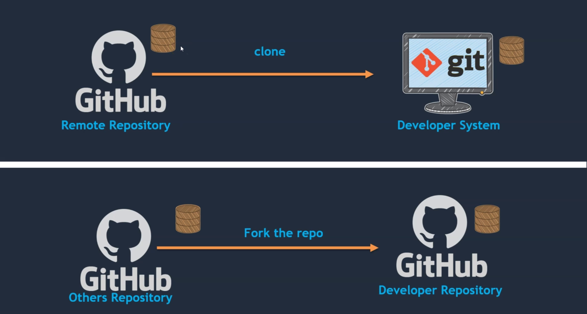
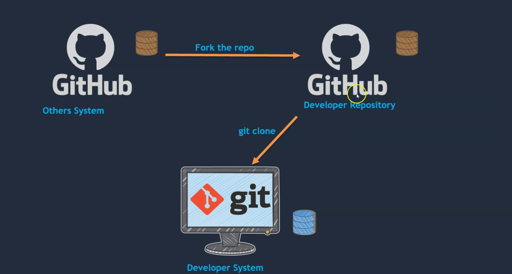
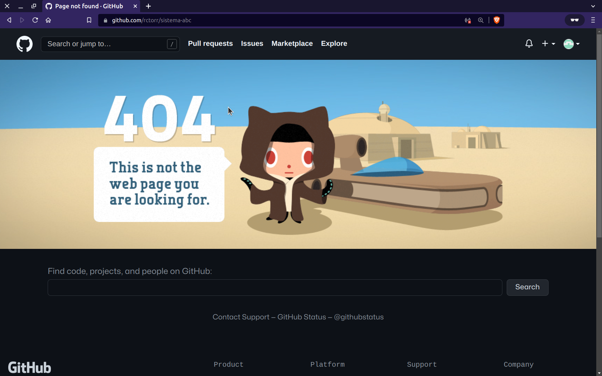
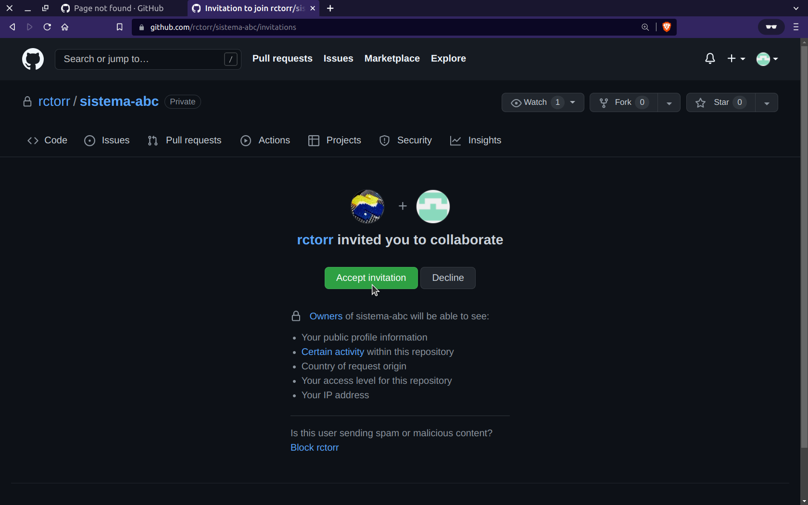

## Módulo 07: Trabajar con el equipo

### Contenido

1. Bifurcar un repositorio
2. Creación de un pull request (PR)
3. Trabajar con repositorios privados
4. Agregar colaborador a un repositorio de GitHub
5. Creación de branche protegido
6. Etiquetado de un commit

### 1. Bifurcar un repositorio


Realizar el fork del repo: https://github.com/rctorr/sistema-abc-plantilla

Y revisar la información del repo bifurcado.

### 2. Creación de un pull request (PR)


Después de realizar la bifurcación el repo ya es nuestro y podemos clonarlo, realizar un cambio, hacer un push y entonces hacer un PR (Pull request) que es una petición que hace el usuario que bifurcó el usuario al usuario del repo original.

Entonces el usuario original puede revisar los PR recibidos y haceptarlos o no.

Clona el repo, realiza un cambio, has un pull y finalmente realizar un PR.

### 3. Trabajar con repositorios privados

Primero examinemos la lista de repos creados en Github, se puede ir desde el menú del usuario y seleccionando la opción **Your repositories**.

Ahora veamos como a la derecha del nombre se indica si el repositorio es **publico** o **privado**.

Para poder crear un repo privado hay dos formas, al momento de crear un repositorio nuevo, elegimos la opción **Private** y entonces el repo resultante será privado.

La otra opción es elegir un repo ya creado y cambiar su visibilidad desde los **Settings** del repo, luego en **General**, ir hasta la zona **Danger Zone** y finalmente dar click en **Change visibility**.

En el diálogo que aparece hay que teclear el nombre del repo, pero sobre todo hay que leer las advertencias, entonces presionar el botón **I understand, change repository visibility** para cambiar la visibilidad.

Entonces vamos a modificar la visibilidad del repo https://github.com/user/sistema-abc (considera usar tu propio repo) a un repo privado, después vayamos a la lista de repos y confirmamos que ahora es privado. 

Ahora vamos a clonarlo usando el protocolo https, generalmente un repo público es posible clonarlo sin permiso alguno, entonces vamos a clonar el repo usando el protocolo https y veamos que pasa:

```
$ git clone https://github.com/rctorr/sistema-abc.git
Clonando en 'sistema-abc'...
Username for 'https://github.com': rctorr
Password for 'https://rctorr@github.com': 
remote: Enumerating objects: 42, done.
remote: Total 42 (delta 0), reused 0 (delta 0), pack-reused 42
Recibiendo objetos: 100% (42/42), 5.02 KiB | 570.00 KiB/s, listo.
Resolviendo deltas: 100% (19/19), listo.

$ 
```
Notar que se necesitan autenticar con usuario para poder clonarlo, así que el uso de el método por ssh sería el más conveniente, veamos que sucede si usamos el protocolo SSH:

Sería bueno eliminar la carpeta `sistema-abc/` y clonar el repo nuevamente usando SSH:
```
$ git clone git@github.com:rctorr/sistema-abc.git
Clonando en 'sistema-abc'...
remote: Enumerating objects: 42, done.
remote: Total 42 (delta 0), reused 0 (delta 0), pack-reused 42
Recibiendo objetos: 100% (42/42), 5.02 KiB | 5.02 MiB/s, listo.
Resolviendo deltas: 100% (19/19), listo.

$ 
```
Aquí no se ha solicitado autheticación porque ya hemos agregado la llave ssh a la configuración de Github.

Ahora hagamos un cambio al archivo `Readme.md`, agregemos al staging, hacemos un commit y finalmente un push:

```
$ git checkout -b privado
$ vim Readme.md
...
$ git add Readme.md
$ git commit -m "Actualizando la visibilidad del repo como una nota en el readme.md"
[privado 5fc0320] Actualizando la visibilidad del repo como una nota en el readme.md
 1 file changed, 1 insertion(+), 1 deletion(-)

$ git push origin privado
Enumerando objetos: 5, listo.
Contando objetos: 100% (5/5), listo.
Compresión delta usando hasta 4 hilos
Comprimiendo objetos: 100% (3/3), listo.
Escribiendo objetos: 100% (3/3), 423 bytes | 423.00 KiB/s, listo.
Total 3 (delta 1), reusado 0 (delta 0), pack-reusado 0
remote: Resolving deltas: 100% (1/1), completed with 1 local object.
remote: 
remote: Create a pull request for 'privado' on GitHub by visiting:
remote:      https://github.com/rctorr/sistema-abc/pull/new/privado
remote: 
To github.com:rctorr/sistema-abc.git
 * [new branch]  privado -> privado

$ 
```
Entonces el proceso de hacer push prácticamente no cambia ya que al igual que con los repos públicos, se requiere de autheticar con usuario y clave o con una llave privada por medio de ssh.

### 4. Agregar colaborador a un repositorio de GitHub
En el punto anterior ya tenemos un repo privado, si intentamos entrar a nuestro repo https://github.com/user/sistema-abc sin estar validados en la página de Github o desde otro usuario entonces obtenemos:



Y se aplican todas las advertencias observadas cuando se volvió privado.

Para permitir que otro usuario pueda acceder al repo, entonces se pueden agregar colaboradores desde el menú de **Settings** -> **Colaboradores**.

Cuando se agregar un colaborador, se le está dando acceso para realizar cualquier operación sólo en éste repo.

Así que vamos a gregarlo al repo protegido de Sistema ABC presionando el botón **Add people** y escribimos el usuario o email del colaborador a agregar y lo seleccionamos de la lista inferior, entonces presionamos el botón con el texto **Add user to this repository**.

**Nota**: Agrega el usuario que tienes a la derecha

Después de unos momento el usuario invitado recibe un mensaje por e-mail, que al abrirlo aparece un botón con el texto **View invitation** que al dar click se apre la siguiente página:



Entonces el usuario receptor puede aceptar se colaborador de ese repo y podemos clonar el repo y realizamos un cambio al archivo `Readme.md` agregando nuestro nombre a la lista de colaboradores, agregamos el cambio a un commit y finalmente hacemos un push.

```
$ git clone https://github.com/rctorr/sistema-abc.git
Clonando en 'sistema-abc'...
Username for 'https://github.com': rictorcb
Password for 'https://rictorcb@github.com': 
remote: Enumerating objects: 45, done.
remote: Counting objects: 100% (3/3), done.
remote: Compressing objects: 100% (3/3), done.
remote: Total 45 (delta 0), reused 2 (delta 0), pack-reused 42
Recibiendo objetos: 100% (45/45), 5.61 KiB | 5.61 MiB/s, listo.
Resolviendo deltas: 100% (19/19), listo.

$ cd sistema-abc/

$ vim Readme.md
...

$ git add Readme.md 

$ git commit -m "Agregándome como colaborador en Readme.md"
[master fbdc120] Agregándome como colaborador en Readme.md
 1 file changed, 4 insertions(+)

$ git push -u origin master
Username for 'https://github.com': rictorcb
Password for 'https://rictorcb@github.com': 
Enumerando objetos: 5, listo.
Contando objetos: 100% (5/5), listo.
Compresión delta usando hasta 4 hilos
Comprimiendo objetos: 100% (3/3), listo.
Escribiendo objetos: 100% (3/3), 428 bytes | 428.00 KiB/s, listo.
Total 3 (delta 1), reusado 0 (delta 0), pack-reusado 0
remote: Resolving deltas: 100% (1/1), completed with 1 local object.
To https://github.com/rctorr/sistema-abc.git
   600a098..fbdc120  master -> master
Rama 'master' configurada para hacer seguimiento a la rama remota 'master' de 'origin'.

$ 
```

**Nota**: Mucho cuidado con éste tipo de permisos, siempre hay que mantener un respaldo local por si algo sale mal.

**Nota 2**: Un repo no es un respaldo

Ahora pide al colaborador a la izquierda que valide los cambios que has realizado.

¿Crees que las instrucciones para realizar los cambios fueron las adecuadas? ¿En qué rama se realizaron los cambios?

### 5. Creación de branche protegido
En el tema anterior dimos acceso a un usuario a todo un repo para clonar, hacer pull o push y además vimos que la modificación se realizó en la rama master lo que podría ser peligroso si los colaboradores no siguen las pautas o políticas establecidas.

Pero también podemos proteger una rama para evitar realizar modoficaciones directamente en ella, en este caso vamos a proteger la rama **master**, para ello nos vamos a **Settings** -> **Branches** -> **Branch protection rules** -> **Add rule**.

Lo anterior nos permite seleccionar la rama a proteger, en éste caso **master** y seleccionamos un requerimiento, por ejemplo requerir que se haga un pull request antes de hacer merge, pero además se requiere un número de aprovaciones del PR para poder hacer merge, por default es 1, pero se podría requerir que dos revisores aprobaran el PR. Damos en el botón de **Save changes**.

Vemos que aparece un mensaje indicando que no es posible restringir ramas en repos privados en cuentas gratuitas, se debe contar con algún plan para poder proteger ramas, así que para avanzar cambiamos la visibilidad del repo a público y entonces vemos que la protección ya ha sido aplicada.

Vamos a comprobar primero hagamos un cambio como dueños del repo al archivo `Readme.md` y lo agregamos al repo y hacemos un `git push`.

Este resultado vemos que si podemos enviar cambios siendo el propietario o administrador del repo.

Ahora hagamos un cambio al repo de nuestro colaborador a la derecha estando en la rama **master**, también modifcando el archivo `Readme.md` incluyendo nuestro nombre de usuario, lo agregamos al repo y hacemos push, entonces nos aparecerá al similar a lo siguiente:

```
...
$ git push 
Username for 'https://github.com': rictorcb
Password for 'https://rictorcb@github.com': 
Enumerando objetos: 5, listo.
Contando objetos: 100% (5/5), listo.
Compresión delta usando hasta 4 hilos
Comprimiendo objetos: 100% (3/3), listo.
Escribiendo objetos: 100% (3/3), 376 bytes | 376.00 KiB/s, listo.
Total 3 (delta 1), reusado 0 (delta 0), pack-reusado 0
remote: Resolving deltas: 100% (1/1), completed with 1 local object.
remote: error: GH006: Protected branch update failed for refs/heads/master.
remote: error: At least 1 approving review is required by reviewers with write access.
To https://github.com/rctorr/sistema-abc.git
 ! [remote rejected] master -> master (protected branch hook declined)
error: fallo el push de algunas referencias a 'https://github.com/rctorr/sistema-abc.git'

$ 
```
Por lo que ya no podemos hacer push directo a **master**, entonces para enviar nuestros cambios hay que hacerlo por medio de una rama, vamos a crear la ramma **dev** con los cambios de master y hacemos un push:

```
$ git checkout -b dev
Cambiado a nueva rama 'dev'

$ git branch -a
* dev
  master
  remotes/origin/HEAD -> origin/master
  remotes/origin/master
  remotes/origin/modulo-2
  remotes/origin/modulo-3
  remotes/origin/privado

$ git push -u origin dev
Username for 'https://github.com': rictorcb
Password for 'https://rictorcb@github.com': 
Enumerando objetos: 5, listo.
Contando objetos: 100% (5/5), listo.
Compresión delta usando hasta 4 hilos
Comprimiendo objetos: 100% (3/3), listo.
Escribiendo objetos: 100% (3/3), 376 bytes | 376.00 KiB/s, listo.
Total 3 (delta 1), reusado 0 (delta 0), pack-reusado 0
remote: Resolving deltas: 100% (1/1), completed with 1 local object.
remote: 
remote: Create a pull request for 'dev' on GitHub by visiting:
remote:      https://github.com/rctorr/sistema-abc/pull/new/dev
remote: 
To https://github.com/rctorr/sistema-abc.git
 * [new branch]      dev -> dev
Rama 'dev' configurada para hacer seguimiento a la rama remota 'dev' de 'origin'

$ 
```

Y ahora toca deshacer los cambios en la rama master, para ello podemos usar `git checkout commit_id`, `git branch -f master`.

Entonces en la página de github entramos al repo del colaborador a la izquierda y veremos que tenemos una nueva rama **dev** que está adelante de **master** y podemos hacer una revisión y crear un PR.

Hacemos el PR y entonces observamos que aunque somos colaboradores no podemos hacer el merge a la rama **master** porque necesitamos una revisión cuando menos.

Así que le pedimos al admin del repo (colaborador a la izquierda) que haga la revisión y autorice el PR.

Entonces abrimos nuestro repo en el que somos dueños y revisamos la listas de PRs, abrimos el PR enviado por el otro usuario y agregamos una revisión y podemos hacer entonces el merge o podemos pedir al colaborador de la derecha que lo haga, tomamos éste último camino.

Nos cambiamos al repo del colaborador a la derecha y vemos que el PR enviado ya está autorizado y ya podemos hacer merge, procedemos y comprobamos que los cambios ya están en la rama **master**.


### 6. Etiquetado de un commit
El etiquetado de commit es muy útil para señalar puntos importantes en la historia de commits:

```
$ git tag v1.0
$ git push origin v1.0
...
$
```

También podemos agregar un mensaje e indicar un commit cualquiera:

```
$ git tag -a v0.1 34ae08c5871063860557fd67bb109787ab3cc8ef -m "Versión inicial beta 0.1 del proyecto"^C

$ git push origin v0.1
Enumerating objects: 1, done.
Counting objects: 100% (1/1), done.
Writing objects: 100% (1/1), 179 bytes | 59.00 KiB/s, done.
Total 1 (delta 0), reused 0 (delta 0), pack-reused 0
To github.com:rctorr/sistema-abc.git
 * [new tag]         v0.1 -> v0.1

```
