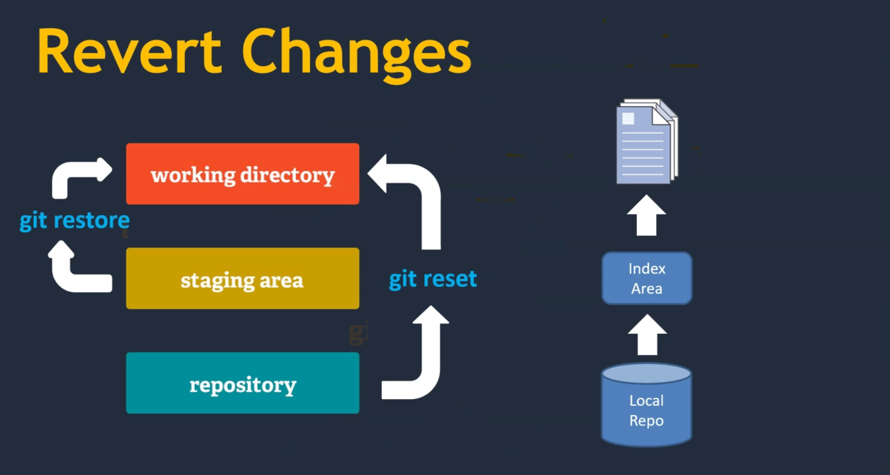

## Módulo 08: Revirtiendo cambios

### Contenido

1. Revertir cambios del directorio de trabajo
2. Reversión de cambios desde el área de preparación y el repositorio local
3. Usando el archivo .Gitignore

### 1. Revertir cambios del directorio de trabajo


Cuando vamos a revertir cambios la primer pregunta es ¿El origen de los archivos para revertir es un commit o es el área de staging? Ya que dependiendo el origen será el comando a usar



Si vamos de área de **staging** hacia la **carpeta de trabajo** entonces usamos `git restore`

Pero si vamos de **un commit del repo** hacia la **carpeta de trabajo** entonces usamos `git reset`

Vemos un ejemplo, en nuestro repo de Sistema ABC en la rama **dev** hagamos un cambio al archivo `Readme.md` entonces el estado será similar al siguiente:

```
$ git status
En la rama dev
Tu rama está actualizada con 'origin/dev'.

Cambios no rastreados para el commit:
  (usa "git add <archivo>..." para actualizar lo que será confirmado)
  (usa "git restore <archivo>..." para descartar los cambios en el directorio de trabajo)
	modificado:     Readme.md

sin cambios agregados al commit (usa "git add" y/o "git commit -a")

```
Como hemos hecho un cambio en nuestro **carpeta de trabajo** el archivo `Readme.md` difiere del **area de staging**, entonces si deseamos restaurar la versión del **área de staging** hacia la **carpeta de trabajo** ejecutamos:

```
$ git restore Readme.md

$ git status
En la rama dev
Tu rama está actualizada con 'origin/dev'.

nada para hacer commit, el árbol de trabajo esta limpio

```
Y con ésto descartamos los cambios realizados en el archivo quedando idéntico al área de staging.

Una forma alternativa es usar el comando `git checkout -- archivo` para restaurar un archivo en la carpeta de trabajo. 


### 2. Reversión de cambios desde el área de preparación y el repositorio local
En el caso de que los cambios ya estén en el área de staging entonces primero hay que restaurar el staging y luego el directorio de trabajo, entonces vamos a realizar nuevamente un cambio al archivo `Readnme.md`, lo agregamos al staging y luego descartamos los cambios.

```
$ vim Readme.md 
...

$ git add Readme.md 
$ git status
En la rama dev
Tu rama está actualizada con 'origin/dev'.

Cambios a ser confirmados:
  (usa "git restore --staged <archivo>..." para sacar del área de stage)
	modificado:     Readme.md

$ git restore --staged Readme.md
$ git status
En la rama dev
Tu rama está actualizada con 'origin/dev'.

Cambios no rastreados para el commit:
  (usa "git add <archivo>..." para actualizar lo que será confirmado)
  (usa "git restore <archivo>..." para descartar los cambios en el directorio de trabajo)
	modificado:     Readme.md

sin cambios agregados al commit (usa "git add" y/o "git commit -a")

$ git restore  Readme.md
$ git status
En la rama dev
Tu rama está actualizada con 'origin/dev'.

nada para hacer commit, el árbol de trabajo esta limpio

```

Pero que pasa si los cambios ya están en el repo local, como descartamos los cambios del último repo por ejemplo, vamos a modificar nuevamente el archivo `Readme.md` y creamos un commit:

```
$ vim Readme.md 
...

$ git add Readme.md 
$ git commit -m "Modificamos Readme.md"
[dev e6317c9] Modificamos Readme.md
 1 file changed, 3 insertions(+)
rictor@fibo:~/sistema-abc-rictorcb$ git status
En la rama dev
Tu rama está adelantada a 'origin/dev' por 1 commit.
  (usa "git push" para publicar tus commits locales)

nada para hacer commit, el árbol de trabajo esta limpio

$ git log --oneline --graph
* e6317c9 (HEAD -> dev) Modificamos Readme.md
* a732c92 (origin/dev) Modificando desde rictorcb ok
* cc9e4e0 (origin/master, origin/HEAD, master) Modificando desde rictorcb
...
```
Ahora para descartar los cambios usamos `git reset`, como vamos un commit atrás podemos referenciar el commit usando `HEAD~1`:

```
$ vim Readme.md
...

$ touch Para-borrar.md
$ git status
En la rama dev
Tu rama está actualizada con 'origin/dev'.

Cambios no rastreados para el commit:
  (usa "git add <archivo>..." para actualizar lo que será confirmado)
  (usa "git restore <archivo>..." para descartar los cambios en el directorio de trabajo)
	modificado:     Readme.md

Archivos sin seguimiento:
  (usa "git add <archivo>..." para incluirlo a lo que se será confirmado)
	Para-borrar.md

sin cambios agregados al commit (usa "git add" y/o "git commit -a")

$ git add .
$ git status
En la rama dev
Tu rama está actualizada con 'origin/dev'.

Cambios a ser confirmados:
  (usa "git restore --staged <archivo>..." para sacar del área de stage)
	nuevo archivo:  Para-borrar.md
	modificado:     Readme.md

$ git commit -m "Para borrar"
[dev 4eb9123] Para borrar
 2 files changed, 3 insertions(+)
 create mode 100644 Para-borrar.md
rictor@fibo:~/sistema-abc-rictorcb$ git status
En la rama dev
Tu rama está adelantada a 'origin/dev' por 1 commit.
  (usa "git push" para publicar tus commits locales)

nada para hacer commit, el árbol de trabajo esta limpio

$ git log 
commit 4eb9123798adf2686ca9cb38b98958f46dcb28fc (HEAD -> dev)
Author: rictor <rictor@gmail.com>
Date:   Wed Aug 10 05:12:56 2022 -0500

    Para borrar

commit a732c92adfdbf2d9d9ac9afc0aa2bf447a20880b (origin/dev)
Author: rictor <rictor@gmail.com>
Date:   Wed Aug 10 03:25:55 2022 -0500
...

$ git reset HEAD~1
Cambios fuera del área de stage tras el reset:
M	Readme.md

$ git status
En la rama dev
Tu rama está actualizada con 'origin/dev'.

Cambios no rastreados para el commit:
  (usa "git add <archivo>..." para actualizar lo que será confirmado)
  (usa "git restore <archivo>..." para descartar los cambios en el directorio de trabajo)
	modificado:     Readme.md

Archivos sin seguimiento:
  (usa "git add <archivo>..." para incluirlo a lo que se será confirmado)
	Para-borrar.md

sin cambios agregados al commit (usa "git add" y/o "git commit -a")

$ git restore Readme.md
$ git status
En la rama dev
Tu rama está actualizada con 'origin/dev'.

Archivos sin seguimiento:
  (usa "git add <archivo>..." para incluirlo a lo que se será confirmado)
	Para-borrar.md

no hay nada agregado al commit pero hay archivos sin seguimiento presentes (usa "git add" para hacerles seguimiento)

$ rm Para-borrar.md 
$ git status
En la rama dev
Tu rama está actualizada con 'origin/dev'.

nada para hacer commit, el árbol de trabajo esta limpio

```
El commit referenciado con `git reset commit` también puede ser usando un commit id.

Finalmente podemos usar `git reset --hard commit` esto restaura una carpeta justo a como está el commit indicado, vamos un ejemplo:

```
$ vim Readme.md
...
$ touch borrame.txt

$ git status
En la rama dev
Tu rama está actualizada con 'origin/dev'.

Cambios no rastreados para el commit:
  (usa "git add <archivo>..." para actualizar lo que será confirmado)
  (usa "git restore <archivo>..." para descartar los cambios en el directorio de trabajo)
	modificado:     Readme.md

Archivos sin seguimiento:
  (usa "git add <archivo>..." para incluirlo a lo que se será confirmado)
	borrame.txt

sin cambios agregados al commit (usa "git add" y/o "git commit -a")

$ git add .
$ git commit -m "Borrame"
[dev c74c277] Borrame
 2 files changed, 3 insertions(+)
 create mode 100644 borrame.txt

$ git status
En la rama dev
Tu rama está adelantada a 'origin/dev' por 1 commit.
  (usa "git push" para publicar tus commits locales)

nada para hacer commit, el árbol de trabajo esta limpio

$ git log
commit c74c277e03b91ab295625c4fb7c74c1172dcbe35 (HEAD -> dev)
Author: rictor <rictor@gmail.com>
Date:   Wed Aug 10 05:39:39 2022 -0500

    Borrame

commit a732c92adfdbf2d9d9ac9afc0aa2bf447a20880b (origin/dev)
Author: rictor <rictor@gmail.com>
Date:   Wed Aug 10 03:25:55 2022 -0500

    Modificando desde rictorcb ok

$ git reset --hard HEAD~1
HEAD está ahora en a732c92 Modificando desde rictorcb ok

$ git status
En la rama dev
Tu rama está actualizada con 'origin/dev'.

nada para hacer commit, el árbol de trabajo esta limpio
rictor@fibo:~/sistema-abc-rictorcb$ ls 
index.html  modulos  Readme.md  static

```
Hay que ocuparlo con cuidado porque los cambios podrían ser irreversibles.

### 3. Usando el archivo .Gitignore
Ahora vamos a ver como podemos descartar desde un archivo hasta carpetas completas por medio del archivo `.gitignore`. Éste archivo se ubica en la carpeta raíz del repo y cada línea contiene una regla que indentifica uno o más archivos a exlcuir del repo.

Vamos a crear el archivo `config-bd.txt` suponiendo que tendría la información de conexión a la base de datos, así que no queremos que se agrege al repo, entonces creamos el archivo `.gitignore` con el contenido:

```
config-bd.txt
```

```
$ vim config-bd.txt
...

$ git status
En la rama dev
Tu rama está actualizada con 'origin/dev'.

Archivos sin seguimiento:
  (usa "git add <archivo>..." para incluirlo a lo que se será confirmado)
	config-bd.txt

no hay nada agregado al commit pero hay archivos sin seguimiento presentes (usa "git add" para hacerles seguimiento)

$ vim .gitignore
...

$ git status
En la rama dev
Tu rama está actualizada con 'origin/dev'.

Archivos sin seguimiento:
  (usa "git add <archivo>..." para incluirlo a lo que se será confirmado)
	.gitignore

no hay nada agregado al commit pero hay archivos sin seguimiento presentes (usa "git add" para hacerles seguimiento)

$ git add .gitignore 
$ git commit -m "Agregando .gitignore"
[dev 78e6d16] Agregando .gitignore
 1 file changed, 2 insertions(+)
 create mode 100644 .gitignore

$ git status
En la rama dev
Tu rama está adelantada a 'origin/dev' por 1 commit.
  (usa "git push" para publicar tus commits locales)

nada para hacer commit, el árbol de trabajo esta limpio

```

Pero también podemo usar comodines para indicar un grupo de archivos:

```
$ mkdir config
$ touch config/bd.txt
$ touch config/email.txt
$ touch config/env.txt
$ git status
En la rama dev
Tu rama está adelantada a 'origin/dev' por 1 commit.
  (usa "git push" para publicar tus commits locales)

Archivos sin seguimiento:
  (usa "git add <archivo>..." para incluirlo a lo que se será confirmado)
	config/

no hay nada agregado al commit pero hay archivos sin seguimiento presentes (usa "git add" para hacerles seguimiento)

$ vim .gitignore 
$ git status
En la rama dev
Tu rama está adelantada a 'origin/dev' por 1 commit.
  (usa "git push" para publicar tus commits locales)

Cambios no rastreados para el commit:
  (usa "git add <archivo>..." para actualizar lo que será confirmado)
  (usa "git restore <archivo>..." para descartar los cambios en el directorio de trabajo)
	modificado:     .gitignore

sin cambios agregados al commit (usa "git add" y/o "git commit -a")

$ git add .
$ git status
En la rama dev
Tu rama está adelantada a 'origin/dev' por 1 commit.
  (usa "git push" para publicar tus commits locales)

Cambios a ser confirmados:
  (usa "git restore --staged <archivo>..." para sacar del área de stage)
	modificado:     .gitignore

$ git commit -m "Actualizando .gitignore para exluir la carpeta config/"
[dev 629cad9] Actualizando .gitignore para exluir la carpeta config/
 1 file changed, 1 insertion(+), 1 deletion(-)

$ git status
En la rama dev
Tu rama está adelantada a 'origin/dev' por 2 commits.
  (usa "git push" para publicar tus commits locales)

nada para hacer commit, el árbol de trabajo esta limpio

```

El último caso es cuando queremos ignorar un archivo que ya está en el repo, pero no queremos descartar el commit completo, si no sólo ese archivo, el procedimiento sería similar a lo siguiente:

```
$ touch sistema.sqlite3
$ git status
En la rama dev
Tu rama está adelantada a 'origin/dev' por 2 commits.
  (usa "git push" para publicar tus commits locales)

Archivos sin seguimiento:
  (usa "git add <archivo>..." para incluirlo a lo que se será confirmado)
	sistema.sqlite3

no hay nada agregado al commit pero hay archivos sin seguimiento presentes (usa "git add" para hacerles seguimiento)

$ git add sistema.sqlite3 
$ git commit -m "Agregando archivo de base de datos"
[dev 00bc5e6] Agregando archivo de base de datos
 1 file changed, 0 insertions(+), 0 deletions(-)
 create mode 100644 sistema.sqlite3

$ git log
commit 00bc5e6fc4f948bdbb98c8b7553fa10f14d7637b (HEAD -> dev)
Author: rictor <rictor@gmail.com>
Date:   Wed Aug 10 05:57:47 2022 -0500

    Agregando archivo de base de datos

commit 629cad9bf74ebfcb9b04abfd562d5c15933dcdc4
Author: rictor <rictor@gmail.com>
Date:   Wed Aug 10 05:54:58 2022 -0500

    Actualizando .gitignore para exluir la carpeta config/
...

$ vim sistema.sqlite3 
$ git status
En la rama dev
Tu rama está adelantada a 'origin/dev' por 3 commits.
  (usa "git push" para publicar tus commits locales)

Cambios no rastreados para el commit:
  (usa "git add <archivo>..." para actualizar lo que será confirmado)
  (usa "git restore <archivo>..." para descartar los cambios en el directorio de trabajo)
	modificado:     sistema.sqlite3

sin cambios agregados al commit (usa "git add" y/o "git commit -a")

$ vim .gitignore 
$ git status
En la rama dev
Tu rama está adelantada a 'origin/dev' por 3 commits.
  (usa "git push" para publicar tus commits locales)

Cambios no rastreados para el commit:
  (usa "git add <archivo>..." para actualizar lo que será confirmado)
  (usa "git restore <archivo>..." para descartar los cambios en el directorio de trabajo)
	modificado:     .gitignore
	modificado:     sistema.sqlite3

sin cambios agregados al commit (usa "git add" y/o "git commit -a")

$ git add .gitignore 
$ git status
En la rama dev
Tu rama está adelantada a 'origin/dev' por 3 commits.
  (usa "git push" para publicar tus commits locales)

Cambios a ser confirmados:
  (usa "git restore --staged <archivo>..." para sacar del área de stage)
	modificado:     .gitignore

Cambios no rastreados para el commit:
  (usa "git add <archivo>..." para actualizar lo que será confirmado)
  (usa "git restore <archivo>..." para descartar los cambios en el directorio de trabajo)
	modificado:     sistema.sqlite3

$ git rm sistema.sqlite3 
error: el siguiente archivo tiene modificaciones locales:
    sistema.sqlite3
(usa --cached para conservar el archivo, o -f para forzar su eliminación)

$ git rm --cached sistema.sqlite3 
rm 'sistema.sqlite3'
$ git status
En la rama dev
Tu rama está adelantada a 'origin/dev' por 3 commits.
  (usa "git push" para publicar tus commits locales)

Cambios a ser confirmados:
  (usa "git restore --staged <archivo>..." para sacar del área de stage)
	modificado:     .gitignore
	borrado:        sistema.sqlite3

$ git commit -m "Eliminando el archivo sistema.sqlite3 del repo e ignorandolo para futuros commits"
[dev 5ed7ffb] Eliminando el archivo sistema.sqlite3 del repo e ignorandolo para futuros commits
 2 files changed, 2 insertions(+)
 delete mode 100644 sistema.sqlite3

$ git status
En la rama dev
Tu rama está adelantada a 'origin/dev' por 4 commits.
  (usa "git push" para publicar tus commits locales)

nada para hacer commit, el árbol de trabajo esta
limpio

$ 
```
