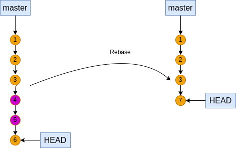
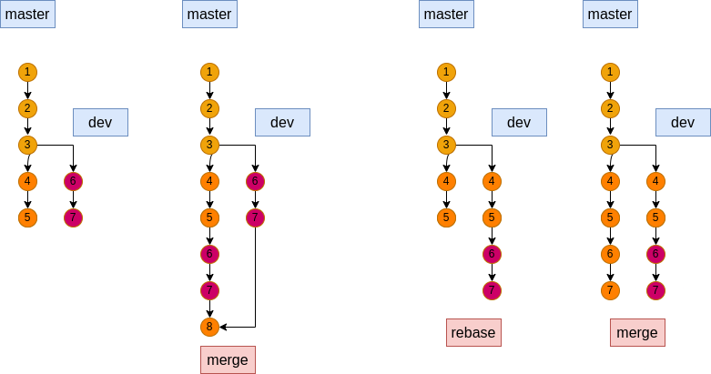
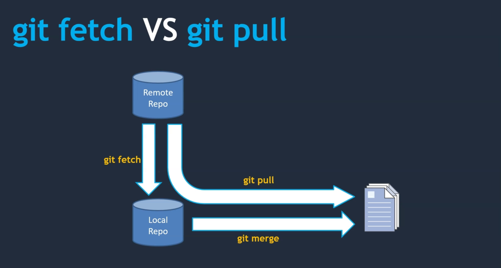

## Módulo 09: Conceptos varios

### Contenido

1. Git Fetch versus Git Pull
2. Git Rebase
3. Git Stash
4. Git blame

### 1. Git Rebase
El comando rebase lo que hace es cambiar la base de la historia de los comits de una rama, así que después de usar rebase la historia de commit no será la misma que antes y es una operación **destructiva**.

En general tiene dos aplicaciones:
1. Compactar varios commits en uno sólo
2. Ayudar a que la fusión de ramas (merge) sea de avance rápido (fast forward)

#### Compactando varios commit en uno solo
Recordemos que un commit almacena los cambios realizados respecto al commit anterior, sin embargo si tomamos un archivo del último commit, éste es el resultado de todos los commits aplicados, así que si se crearon 5 commits para llegar a la versión actual de un archivo significa que podríamos eliminar los 4 commit anteriores y quedarnos sólo con el último commit para simplificar al árbol del historial del commit, pero ésta es una operación **destructiva** y se recomienda hacer sólo en commit que no estén en un repo remoto ya que los commits eliminados no se podrán recuperar, pero la rama tendrá menos commits en su historia.



Veamos un ejemplo, vamos a crear una nueva carpeta para el **proyecto-1**, inicializa un repo y vamos a crear el archivo `index.html` con el siguiente contenido pero crea un commit por cada etiqueta distinta.

```
<!DOCTYPE html>
<html>
<body>
</body>
  <h1>Haciendo un commit por tarea</h1>
</html>
```
La bitácora de commit quedaría:

```
$ git log
commit 212d923e61996542bca400e9647bd126abfb7a19 (HEAD -> master)
Author: rctorr <rictor@cuhrt.com>
Date:   Thu Aug 11 19:21:59 2022 -0500

    Agregando etiqueta <h1> a index.html

commit 6b8f191f577af6a380b07542db0c31df1e530558
Author: rctorr <rictor@cuhrt.com>
Date:   Thu Aug 11 19:21:21 2022 -0500

    Agregando etiqueta <body> a index.html

commit 9c9b7d55f86a03ca349718cfc403139bf0be19c4
Author: rctorr <rictor@cuhrt.com>
Date:   Thu Aug 11 19:20:57 2022 -0500

    Agregando etiqueta <html> a index.html

commit 6b18c6a4732324c252393bfea9278f9d5a227e88
Author: rctorr <rictor@cuhrt.com>
Date:   Thu Aug 11 19:20:18 2022 -0500

    Agregrando DOCTYPE a index.html
```
Después de una revisión con el lider de proyecto nos dice "compacta los 3 últimos commits en uno", para eso está `git rebase`

```
$ commit 212d923e61996542bca400e9647bd126abfb7a19 (HEAD -> master)
Author: rctorr <rictor@cuhrt.com>
Date:   Thu Aug 11 19:21:59 2022 -0500

    Agregando etiqueta <h1> a index.html

commit 6b8f191f577af6a380b07542db0c31df1e530558
Author: rctorr <rictor@cuhrt.com>
Date:   Thu Aug 11 19:21:21 2022 -0500

    Agregando etiqueta <body> a index.html

commit 9c9b7d55f86a03ca349718cfc403139bf0be19c4
Author: rctorr <rictor@cuhrt.com>
Date:   Thu Aug 11 19:20:57 2022 -0500

    Agregando etiqueta <html> a index.html

commit 6b18c6a4732324c252393bfea9278f9d5a227e88
Author: rctorr <rictor@cuhrt.com>
Date:   Thu Aug 11 19:20:18 2022 -0500

    Agregrando DOCTYPE a index.html

```
Así está nuestra historia de commits, entonces aplicamos `git rebase` y revisamos la historia de nuevo.

```
$ git rebase -i HEAD~3
...
```
La opción `-i` significa rebase interactivo, así que tras ejecutar el comando se abre un editor para indicar de que manera se aplicará el rebase.

```
pick 9c9b7d5 Agregando etiqueta <html> a index.html
pick 6b8f191 Agregando etiqueta <body> a index.html
pick 212d923 Agregando etiqueta <h1> a index.html

# Rebase 6b18c6a..212d923 en 6b18c6a (3 comandos)
#
# Comandos:
# p, pick <commit> = usar commit
# r, reword <commit> = usar commit, pero editar el mensaje de commit
# e, edit <commit> = usar commit, pero parar para un amend
# s, squash <commit> = usar commit, pero fusionarlo en el commit previo
# f, fixup <commit> = como "squash", pero descarta el mensaje del log de este c>
#       , a menos que se use -C, en cuyo caso
#       mantiene solo el mensaje del commit; -c es lo mismo que -C
#       pero abre el editor
# x, exec <commit> = ejecuta comando ( el resto de la línea) usando un shell
# b, break = parar aquí (continuar rebase luego con 'git rebase --continue')
...
```
Entonces se puede ver que un rebase interactivo permite realizar una variedad de operaciones sobre un commit, pero la que nos intereza es **aplastar** (squash), así que modificamos las líneas de los commits a aplastar y guardamos los cambios y salimos del editor, entonces se nos presenta una segunda interacción en un editor que nos pide indicar el nuevo mensaje para el commit resultante, así que modificamos el contenido hasta quedar satisfechos, guardamos y salimos:

```
$ git log
commit c81f1c1af97fa0b891ef0d34e6547ed2f1d30bf6 (HEAD -> master)
Author: rctorr <rictor@cuhrt.com>
Date:   Thu Aug 11 19:20:57 2022 -0500

    Agregando etiqueta <html> a index.html
    Agregando etiqueta <body> a index.html
    Agregando etiqueta <h1> a index.html

commit 6b18c6a4732324c252393bfea9278f9d5a227e88
Author: rctorr <rictor@cuhrt.com>
Date:   Thu Aug 11 19:20:18 2022 -0500

    Agregrando DOCTYPE a index.html
```
Entonces ahora tenemos sólo dos commits y ya podermos darle gusto a "quien corresponda".

#### Ayudar a que la fusión de ramas (merge) sea de avance rápido (fast forward)
Éste caso sucede cuando derivamos una nueva rama, agregamos nuevos commits, pero paralelamente en la rama origen también se agregan nuevos commits, si al final queremos fusionar la rama derivada no se puede aplicar un avance rápido (fast forward) porque hay modificaciones en la rama origen y se tiene forsozamente crear un nuevo commit para hacer la fusión.



Entonces hagamos un ejemplo creando la rama **dev** y agregando los archivos `modulo-1.html` y `modulo-2.html` en la carpeta `modulos/`:

```
$ git checkout -b dev
$ mkdir modulos
$ touch modulos/modulo-1.html
$ git add . && git commit -m "Agregando módulo 1"
$ touch modulos/modulo-2.html
$ git add . && git commit -m "Agregando módulo 2"
```
Nos pasamos a **master** y creamos los archivos `modulo-3.html` y `modulo-4.html` en la misma carpeta:

```
$ checkout master
$ mkdir modulos
$ touch modulos/modulo-3.html
$ git add . && git commit -m "Agregando módulo 3"
$ touch modulos/modulo-4.html
$ git add . && git commit -m "Agregando módulo 4"
$ git log --oneline --graph --all
* 70b0dba (HEAD -> master) Agregando módulo 4
* 705bac3 Agregando módulo 3
| * ad39ba4 (dev) Agregando módulo 2
| * a0eef2a Agregando módulo 1
|/  
* c81f1c1 (backup) Agregando etiqueta <html> a index.html Agregando etiqueta <body> a index.html Agregando etiqueta <h1> a index.html
* 6b18c6a Agregrando DOCTYPE a index.html
```
Tenemos dos ramas y ahora queremos fusionar **dev** en **master**, lo que no se puede hacer con un avance rápido porque hay nuevos commit en ambas ramas:

```
$ git merge dev
Merge made by the 'ort' strategy.
 modulos/modulo-1.html | 0
 modulos/modulo-2.html | 0
 2 files changed, 0 insertions(+), 0 deletions(-)
 create mode 100644 modulos/modulo-1.html
 create mode 100644 modulos/modulo-2.html

$ git log --oneline --graph 
*   4aba7fd (HEAD -> master) Merge branch 'dev'
|\  
| * ad39ba4 (dev) Agregando módulo 2
| * a0eef2a Agregando módulo 1
* | 70b0dba (backup) Agregando módulo 4
* | 705bac3 Agregando módulo 3
|/  
* c81f1c1 Agregando etiqueta <html> a index.html Agregando etiqueta <body> a index.html Agregando etiqueta <h1> a index.html
* 6b18c6a Agregrando DOCTYPE a index.html
```
Vemos que en la rama **master** están primero los commits de los módulos 3 y 4, después los commits de los módulos 1, 2 y entonces está el commit que hace la fusión de las dos ramas.

Ahora vamos a hacer lo mismo pero usando **rebase**:

```
$ git reset --hard backup
HEAD está ahora en 70b0dba Agregando módulo 4

$ git log --oneline --graph --all
* 70b0dba (HEAD -> master, backup) Agregando módulo 4
* 705bac3 Agregando módulo 3
| * ad39ba4 (dev) Agregando módulo 2
| * a0eef2a Agregando módulo 1
|/  
* c81f1c1 Agregando etiqueta <html> a index.html Agregando etiqueta <body> a index.html Agregando etiqueta <h1> a index.html
* 6b18c6a Agregrando DOCTYPE a index.html

$ git checkout dev
$ git rebase master
Rebase aplicado satisfactoriamente y actualizado refs/heads/dev.

$ git log --oneline --graph --all
* 123322a (HEAD -> dev) Agregando módulo 2
* 214ae2a Agregando módulo 1
* 70b0dba (master, backup) Agregando módulo 4
* 705bac3 Agregando módulo 3
* c81f1c1 Agregando etiqueta <html> a index.html Agregando etiqueta <body> a index.html Agregando etiqueta <h1> a index.html
* 6b18c6a Agregrando DOCTYPE a index.html
```
Se integran los commit de master a dev, entonces ahora si podemos aplicar un merge de tipo avance rápido:

```
$ git checkout master
Cambiado a rama 'master'

$ git log --oneline --graph --all
* 123322a (dev) Agregando módulo 2
* 214ae2a Agregando módulo 1
* 70b0dba (HEAD -> master, backup) Agregando módulo 4
* 705bac3 Agregando módulo 3
* c81f1c1 Agregando etiqueta <html> a index.html Agregando etiqueta <body> a index.html Agregando etiqueta <h1> a index.html
* 6b18c6a Agregrando DOCTYPE a index.html

$ git merge dev
Actualizando 70b0dba..123322a
Fast-forward
 modulos/modulo-1.html | 0
 modulos/modulo-2.html | 0
 2 files changed, 0 insertions(+), 0 deletions(-)
 create mode 100644 modulos/modulo-1.html
 create mode 100644 modulos/modulo-2.html

$ git log --oneline --graph --all
* 123322a (HEAD -> master, dev) Agregando módulo 2
* 214ae2a Agregando módulo 1
* 70b0dba (backup) Agregando módulo 4
* 705bac3 Agregando módulo 3
* c81f1c1 Agregando etiqueta <html> a index.html Agregando etiqueta <body> a index.html Agregando etiqueta <h1> a index.html
* 6b18c6a Agregrando DOCTYPE a index.html
```
Ahora la etiquete de master ya está actualizada y se observa una sola línea y si eliminamos las ramas dev y backup no sabríamos incluso que existieron esas dos ramas.

La desición de usar una u otra forma dependerá de la estrategia que siga el equipo de desarrollo.

**Nota:** Recuerda no usar **rebase** en commit que ya se han subido a un repo remoto porque los id de los commits implicados cambian y se está alterando la historia ya así que varios commits dejan de existir y otros tienen nuevos id.

### 2. Git Fetch versus Git Pull


Durante las actividades anteriores hemos usado `git pull` constantemente y vemos que es una forma práctica de actualizar un rama local con los cambios de una rama remota, pero en realidad están sucediendo dos comandos `git fetch` que actualiza el repo local y luego `git merge` que actualiza la carpeta de trabajo.

Veamos un ejemplo, en la rama **dev** vamos a agregar una línea al archivo `modulo-1.html`, creamos el repo en Github, lo vinculamos y enviamos la rama **dev** con `git push`.

```
$ git checkout dev
Cambiado a rama 'dev'

$ vim modulos/modulo-1.html 

$ git commit -a -m "Agregando el DOCTYPE a modulo-1.html"
[dev bd62e8d] Agregando el DOCTYPE a modulo-1.html
 1 file changed, 2 insertions(+)

$ git status
En la rama dev
nada para hacer commit, el árbol de trabajo esta limpio

$ git log --oneline --graph --all
* bd62e8d (HEAD -> dev) Agregando el DOCTYPE a modulo-1.html
* 123322a (master) Agregando módulo 2
* 214ae2a Agregando módulo 1
* 70b0dba (backup) Agregando módulo 4
* 705bac3 Agregando módulo 3
* c81f1c1 Agregando etiqueta <html> a index.html Agregando etiqueta <body> a index.html Agregando etiqueta <h1> a index.html
* 6b18c6a Agregrando DOCTYPE a index.html

$ git remote add origin git@github.com:rctorr/proyecto-1.git

$ git push -u origin dev
Enumerando objetos: 23, listo.
Contando objetos: 100% (23/23), listo.
Compresión delta usando hasta 4 hilos
Comprimiendo objetos: 100% (17/17), listo.
Escribiendo objetos: 100% (23/23), 2.00 KiB | 1023.00 KiB/s, listo.
Total 23 (delta 2), reusado 0 (delta 0), pack-reusado 0
remote: Resolving deltas: 100% (2/2), done.
To github.com:rctorr/proyecto-1.git
 * [new branch]      dev -> dev
Rama 'dev' configurada para hacer seguimiento a la rama remota 'dev' de 'origin'.

$ git log --oneline --graph --all
* bd62e8d (HEAD -> dev, origin/dev) Agregando el DOCTYPE a modulo-1.html
* 123322a (master) Agregando módulo 2
* 214ae2a Agregando módulo 1
* 70b0dba (backup) Agregando módulo 4
* 705bac3 Agregando módulo 3
* c81f1c1 Agregando etiqueta <html> a index.html Agregando etiqueta <body> a index.html Agregando etiqueta <h1> a index.html
* 6b18c6a Agregrando DOCTYPE a index.html
```
Ahora agregemos la misma línea al archivo `modulo-2.html` pero usando Github y entonces ejecutamos `git fetch` y luego `git merge`:

```
$ git log --oneline --graph --all
* bd62e8d (HEAD -> dev, origin/dev) Agregando el DOCTYPE a modulo-1.html
* 123322a (master) Agregando módulo 2
* 214ae2a Agregando módulo 1
* 70b0dba (backup) Agregando módulo 4
* 705bac3 Agregando módulo 3
* c81f1c1 Agregando etiqueta <html> a index.html Agregando etiqueta <body> a index.html Agregando etiqueta <h1> a index.html
* 6b18c6a Agregrando DOCTYPE a index.html

$ git fetch
remote: Enumerating objects: 7, done.
remote: Counting objects: 100% (7/7), done.
remote: Compressing objects: 100% (3/3), done.
Desempaquetando objetos: 100% (4/4), 741 bytes | 741.00 KiB/s, listo.
remote: Total 4 (delta 1), reused 0 (delta 0), pack-reused 0
Desde github.com:rctorr/proyecto-1
   bd62e8d..42a4056  dev        -> origin/dev

$ git log --oneline --graph --all
* 42a4056 (origin/dev) Agregando DOCTYPE al módulo-2.html
* bd62e8d (HEAD -> dev) Agregando el DOCTYPE a modulo-1.html
* 123322a (master) Agregando módulo 2
* 214ae2a Agregando módulo 1
* 70b0dba (backup) Agregando módulo 4
* 705bac3 Agregando módulo 3
* c81f1c1 Agregando etiqueta <html> a index.html Agregando etiqueta <body> a index.html Agregando etiqueta <h1> a index.html
* 6b18c6a Agregrando DOCTYPE a index.html

$ git merge
Actualizando bd62e8d..42a4056
Fast-forward
 modulos/modulo-2.html | 1 +
 1 file changed, 1 insertion(+)

$ git log --oneline --graph --all
* 42a4056 (HEAD -> dev, origin/dev) Agregando DOCTYPE al módulo-2.html
* bd62e8d Agregando el DOCTYPE a modulo-1.html
* 123322a (master) Agregando módulo 2
* 214ae2a Agregando módulo 1
* 70b0dba (backup) Agregando módulo 4
* 705bac3 Agregando módulo 3
* c81f1c1 Agregando etiqueta <html> a index.html Agregando etiqueta <body> a index.html Agregando etiqueta <h1> a index.html
* 6b18c6a Agregrando DOCTYPE a index.html
```
Así que podríamos comparar los cambios antes de aplicarlos por ejemplo.

### 3. Git Stash

A veces estamos trabajando en una modificación, digamos actualizando la descripción del archivo `index.html` y antes de terminar nos piden agregar una capa `<div class="contenido">` para agrupar todo el contenido de la página `index.html`, entonces hacemos uso de `git stash save mensaje`, realizamos las nuevas modificaciones, agregamos el archivo al área de staging y nuevamente no insterrumpen con otro cambio.

Agregar la línea del `DOCTYPE` al archivo `modulo-4.html`, entonces para no perder los cambios haceos uso de `git stash`, realizamos los cambios

```
$ vim index.html  # se agrega <p>Descripción de página de inicio</p>

$ git stash save "Primer stash"

$ vim index.html  # se agrega la capa div
$ git add index.html  # se agrega a staging
$ git stash save "Segundo stash"

$ vim modulos/modulo-4.html  # se agrega el DOCTYPE
$ git add modulos/modulo-4.html
$ git commit -m "Agregando DOCTYPE a modulo-4"

$ git pop
...
$ git commit -m "Agregando capa de contenido a index.html"
$ git apply stash@{0}  # esto no elimina el stash
...
$ git status  # pero podemos tener conflictos
...
$ vim index.html  # resolvemos conflictos
$ git add index.html
$ git commit -m "Agregando descripción a index.html"
$ git status
...
$ git stash drop stash@{0}
$ git stash list
```
Observar que el **stash** se comporta como una pila, así que **save** agrega un elemento y con **pop** restauramos el último stash y se elimina de la lista.

### 4. Git blame o annotate

El comando **blame** es muy similar al comando **annotate**, la diferencia radica en el formato de salida y en que **annotate** es usado por compatibilidad para scripts anteriores así que es recomendado usar **blame**:

```
$ git annotate index.html
6b18c6a4        (    rctorr     2022-08-11 19:20:18 -0500       1)<!DOCTYPE html>
c81f1c1a        (    rctorr     2022-08-11 19:20:57 -0500       2)<html>
c81f1c1a        (    rctorr     2022-08-11 19:20:57 -0500       3)<body>
c81f1c1a        (    rctorr     2022-08-11 19:20:57 -0500       4)</body>
c81f1c1a        (    rctorr     2022-08-11 19:20:57 -0500       5)  <h1>Haciendo un commit por tarea</h1>
5a83476b        (    rctorr     2022-08-12 05:31:52 -0500       6)  <hr />
5a83476b        (    rctorr     2022-08-12 05:31:52 -0500       7)  <div class="contenido">
f869498b        (    rctorr     2022-08-12 05:53:41 -0500       8)    <p>Actualización sin terminar ...</p>
5a83476b        (    rctorr     2022-08-12 05:31:52 -0500       9)  </div>
328bbcc2        (    rctorr     2022-08-12 05:29:35 -0500       10)  <footer>
328bbcc2        (    rctorr     2022-08-12 05:29:35 -0500       11)    <p>Derechos reservados</p>
328bbcc2        (    rctorr     2022-08-12 05:29:35 -0500       12)  </footer>
c81f1c1a        (    rctorr     2022-08-11 19:20:57 -0500       13)</html>

$ git blame index.html
^6b18c6a (rctorr 2022-08-11 19:20:18 -0500  1) <!DOCTYPE html>
c81f1c1a (rctorr 2022-08-11 19:20:57 -0500  2) <html>
c81f1c1a (rctorr 2022-08-11 19:20:57 -0500  3) <body>
c81f1c1a (rctorr 2022-08-11 19:20:57 -0500  4) </body>
c81f1c1a (rctorr 2022-08-11 19:20:57 -0500  5)   <h1>Haciendo un commit por tarea</h1>
5a83476b (rctorr 2022-08-12 05:31:52 -0500  6)   <hr />
5a83476b (rctorr 2022-08-12 05:31:52 -0500  7)   <div class="contenido">
f869498b (rctorr 2022-08-12 05:53:41 -0500  8)     <p>Actualización sin terminar ...</p>
5a83476b (rctorr 2022-08-12 05:31:52 -0500  9)   </div>
328bbcc2 (rctorr 2022-08-12 05:29:35 -0500 10)   <footer>
328bbcc2 (rctorr 2022-08-12 05:29:35 -0500 11)     <p>Derechos reservados</p>
328bbcc2 (rctorr 2022-08-12 05:29:35 -0500 12)   </footer>
c81f1c1a (rctorr 2022-08-11 19:20:57 -0500 13) </html>

```
