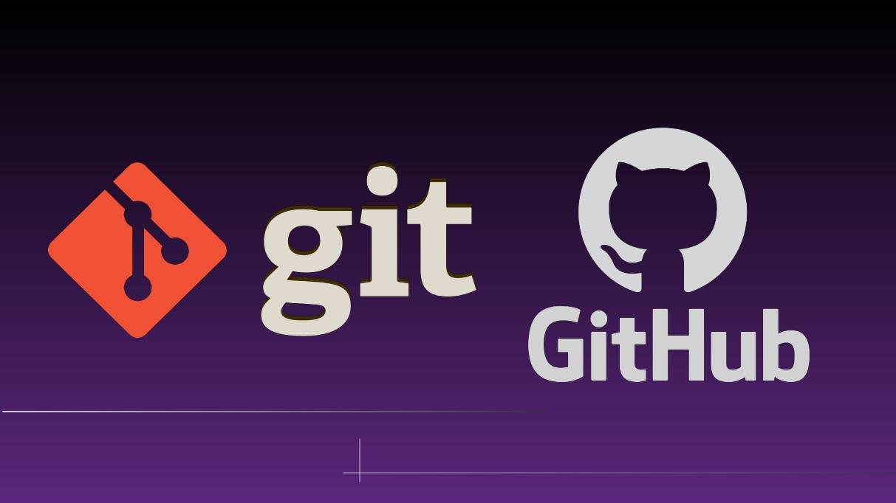

## Trabajando con Git y Github

## Instructor:

- Ricardo Torres
- Email: rictor@cuhrt.com
- Github: https://github.com/rctorr
- Twitter: https://twitter.com/rctorr
- Lenguajes de programación: Python, PHP, C, Java, Javascript.

### Temario 
 
 - [Módulo 01: Introducción al curso](Modulo-01/Readme.md)
 - [Módulo 02: Trabajando con Git](Modulo-02/Readme.md)
 - [Módulo 03: Trabajar con Github](Modulo-03/Readme.md)
 - [Módulo 04: Trabajar con otros desarrolladores](Modulo-04/Readme.md)
 - [Módulo 05: Commits (confirmaciones)](Modulo-05/Readme.md)
 - [Módulo 06: Branches (ramas)](Modulo-06/Readme.md)
 - [Módulo 07: Trabajar con el equipo](Modulo-07/Readme.md)
 - [Módulo 08: Revisión de cambios](Modulo-08/Readme.md)
 - [Módulo 09: Conceptos varios](Modulo-09/Readme.md)
 - [Módulo-10: Ejemplo Git y Github con un proyecto](Modulo-10/Readme.md) 

### Repositorio

- [Repositorio](https://github.com/rctorr/Trabajando-con-Git-y-Github)

